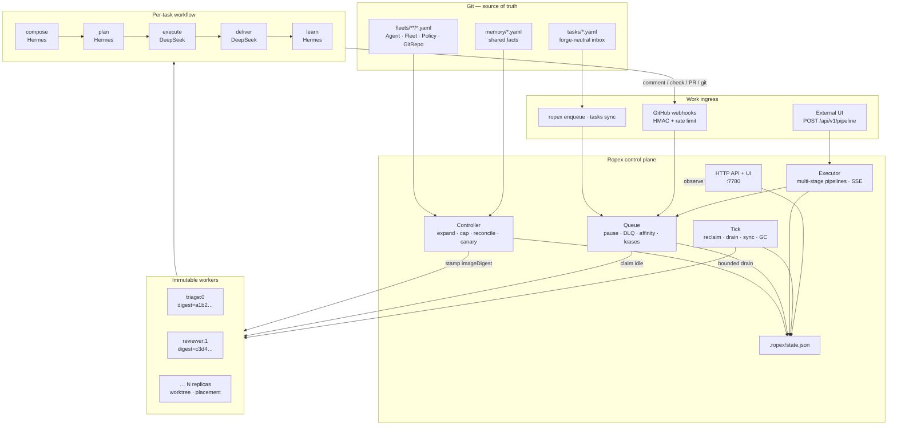
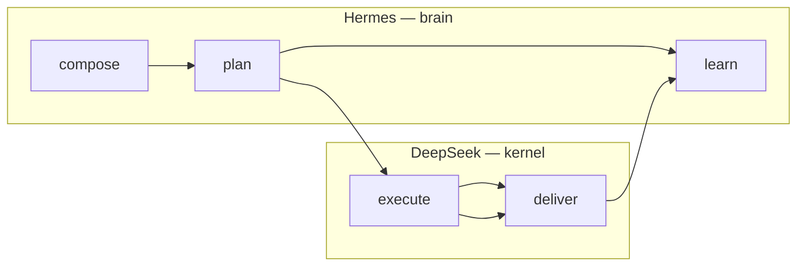

# Ropex

Git is the control plane. Agents are the workload. **The queue is pluggable** — git-native Task YAML, CLI, optional GitHub webhooks, or the **executor API** for external orchestrators like Magentic.

The name is from **RoPE** (rotary position embeddings) — the trick that lets a transformer keep many tokens in one coherent sequence. Ropex does the same for agents: one git sequence, many workers in position.

Each worker is **DeepSeek Harness** (Cordis plugin kernel) plus **Hermes** (soul, memory, skills, closed learning loop). You declare desired state in git; a controller derives immutable workers; they reconcile toward it.

## System architecture



**Scale is a git commit:** change `spec.replicas` from 20 to 2000. Policy caps blast radius. Operators pause, drain, run pipelines, and inspect trajectories from CLI or [`ropex ui`](./docs/control-plane-ui.md).

## Why this exists

Coding agents today are single-player. Ropex combines three proven ideas:

| Layer | Source | Ropex role |
| --- | --- | --- |
| Composable kernel | [DeepSeek Harness](https://github.com/deepseek-ai/DeepSeek-Harness) (Cordis) | Execute tool loops with profile packs |
| Durable brain | [Hermes Agent](https://github.com/NousResearch/hermes-agent) | Plan, remember, learn skills |
| Fleet operations | GitOps (Flux/Fleet style) | Declare replicas, reconcile drift, cap with policy |

Ropex is the control plane that multiplies those runtimes across repos and optional GitHub — the way Kubernetes multiplied containers across clusters.

## Quick start

If `npm install` hangs, use the bootstrap script (skips the huge live DeepSeek tree):

```bash
bash scripts/bootstrap.sh
```

Or manually:

```bash
# edit package.json — delete the whole "optionalDependencies" block
rm -rf node_modules package-lock.json
npm install --no-fund --no-audit
```

Normal path (after PR #16 merge / on `cursor/npm-install-fast-4b15`):

```bash
npm install
npm test

# End-to-end sandbox (no network, no API keys)
npx tsx src/cli.ts demo --root /tmp/ropex-demo

# Load example fleet + control-plane UI
npx tsx src/cli.ts apply fleets/examples/github-control-plane.yaml
npx tsx src/cli.ts ui                    # http://127.0.0.1:7780
```

`npm install` only pulls Ropex’s small deps (`yaml`, TypeScript, vitest). Live backends are **not** installed by default — `@deepseek-ai/dsh` is a huge tree and will make install look stuck. Simulated Hermes/DeepSeek work out of the box.

For live backends later (optional):

```bash
npm install @deepseek-ai/dsh@^0.1.1-rc.2 hermes-agent@^0.20.5
export OPENAI_API_KEY=sk-...   # preferred for live harness
# export DEEPSEEK_API_KEY=...  # optional fallback
# then: ROPEX_DSH_BACKEND=live ROPEX_HERMES_BACKEND=live
```

If a previous install hung, cancel it (`Ctrl+C`) and run:

```bash
bash scripts/bootstrap.sh
# or:
rm -rf node_modules package-lock.json
npm install
```

```bash
# Executor API (CLI or UI Pipelines section)
npx tsx src/cli.ts pipeline "Summarize the repo layout"

# Forge-neutral tasks (any git server)
npx tsx src/cli.ts apply fleets/examples/forge-local.yaml
npx tsx src/cli.ts tasks sync
npx tsx src/cli.ts drain --concurrency 2

# Observability
npx tsx src/cli.ts trajectories --jsonl
npx tsx src/cli.ts metrics --prometheus
npx tsx src/cli.ts health
```

`apply` reads YAML, expands fleets, applies policy, and writes `.ropex/state.json`. Soul/skills/harness edits change the **agent image digest** → reconcile retires old workers and boots new ones (immutable roll, not in-place mutation).

## Documentation

| Guide | Topics |
| --- | --- |
| [**Architecture**](./docs/architecture.md) | Kubernetes mapping, image digests, queue, workflow, executor layer |
| [**Control-plane UI**](./docs/control-plane-ui.md) | Dashboard, deep-dive drawer, live pipeline SSE |
| [**HTTP API**](./docs/api.md) | All `/api/v1/*` routes |
| [**Executor API**](./docs/executor-api.md) | Pipelines, SSE events, Magentic contract |
| [**Forge-neutral tasks**](./docs/forge-neutral.md) | Task YAML without GitHub |
| [**Hermes wiring**](./docs/hermes.md) | Offline brain vs live process |
| [**DeepSeek wiring**](./docs/dsh.md) | Profile packs vs `@deepseek-ai/dsh` |
| [**Magentic integration**](./integrations/magentic/README.md) | External chat UI → Ropex executor |
| [**Docs index**](./docs/README.md) | Full table of contents |

## Manifests

```yaml
apiVersion: ropex.dev/v1
kind: Fleet
metadata:
  name: pr-factory
spec:
  replicas: 20
  template:
    spec:
      harness:
        profile: code          # minimal | code | standard | creator
        model: deepseek-v4-pro
        plugins: [github, fs, shell]
      hermes:
        soul: souls/builder.md
        memory: shared          # sqlite | none | shared
        share:
          read: [agent, fleet]
          write: agent
        learning: true
        skills: [implement-issue, open-pr]
      github:
        events: [issues.labeled]
        deliver: pull_request
      selector:
        matchLabels:
          org: acme
```

| Kind | Role |
| --- | --- |
| `GitRepo` | Where the controller pulls desired state |
| `Agent` | One named worker type (Hermes + harness profile) |
| `Fleet` | Replica set of agents, selected onto repos |
| `Policy` | Max replicas, permission denylist, optional budget |
| `Task` | Git-native work item ([forge-neutral](./docs/forge-neutral.md)) |
| `Memory` | Git-declared shared memory fact |

Example fleets: `fleets/examples/github-control-plane.yaml`, `forge-local.yaml`.

## Runtime split

**Hermes** (`src/hermes.ts`) — compose, plan, remember, learn. Soul + skills + scoped `MemoryPort`.

**DeepSeek Harness** (`src/dsh.ts`, `src/plugins.ts`) — Cordis-shaped kernel: loop mode, tools, permissions, delivery plugin.

**Ropex glue** — `src/runtime.ts` runs the fixed workflow; `src/controller.ts` reconciles workers; `src/executor.ts` runs multi-stage pipelines for external orchestrators.

**Shared memory** — scoped (`worker` | `agent` | `fleet` | `cluster`) with `hermes.share` policy. Contracts in `src/contracts.ts`; store in `src/memory.ts`.



## Executor API + external UI

Ropex exposes an engine-neutral HTTP + SSE contract so **Magentic** (or any client) can orchestrate without embedding LangGraph:

```bash
ropex ui   # POST /api/v1/pipeline + GET /api/v1/events on :7780
```

Flow: submit prompt → plan stages → scoped sequential drain → stream `{ type, data }` events → terminal `pipeline.end`.

See [executor-api.md](./docs/executor-api.md) and [integrations/magentic/README.md](./integrations/magentic/README.md).

The built-in **control-plane UI** also submits pipelines, streams live stage logs, and drill-down into trajectories and agent surfaces — see [control-plane-ui.md](./docs/control-plane-ui.md).

## GitHub as optional agent OS

1. Human opens an issue (or labels it).
2. Controller matches `github.events` + selectors.
3. Idle worker runs Hermes→DeepSeek workflow.
4. Delivery writes comment, check, or pull request.
5. Hermes learning persists a skill for the next replica.

GitHub provides auth, review, CI, and blame. Ropex uses that instead of inventing another agent console. For non-GitHub forges, use [Task YAML](./docs/forge-neutral.md).

## Project layout

```
fleets/           Desired state YAML
src/
  controller.ts   GitOps reconciler
  scheduler.ts    Queue drain + leases
  runtime.ts      Per-task workflow
  executor.ts     Pipeline API + SSE
  api.ts          HTTP control plane
  ui/             Static dashboard
  hermes.ts       Brain contract
  dsh.ts          Harness adapter
  contracts.ts    Shared types for CLI/API/UI
tests/            Network-free vitest suite
docs/             Architecture, API, wiring guides
integrations/     Magentic adapter notes
.ropex/           Local cluster state
```

## Status

| Area | Shipped |
| --- | --- |
| Immutable workers + image digests | yes |
| Hermes plan/learn + DeepSeek execute/deliver | yes (simulated backends) |
| Scoped shared memory + git sync/export | yes |
| Fair queue, leases, DLQ, retry, pause, affinity | yes |
| HMAC webhooks + rate limits | yes |
| Policy admission, budget, fan-out | yes |
| Trajectories, skills registry, audit trail | yes |
| Health probes + backlog SLO | yes |
| Control-plane UI + `/api/v1/view` | yes |
| **Executor API** (pipelines, SSE, scoped drain) | yes |
| **UI deep-dive** (pipelines, trajectories, agent surfaces) | yes |
| **UI live pipeline SSE** | yes |
| Remote git clone | yes (`--remote`) |
| Live `@deepseek-ai/dsh` / Hermes process | seam documented, not default |

Full capability matrix: [architecture.md](./docs/architecture.md). Roadmap log: [ideas.md](./docs/ideas.md).

## Policy for scale

Never spawn uncapped fleets. Always declare `Policy.maxReplicas`. The controller derives workers — do not hard-code replica lists in application code.

## License

[AGPL-3.0-only](./LICENSE) — GNU Affero General Public License v3. Network service operators must offer corresponding source to users.
