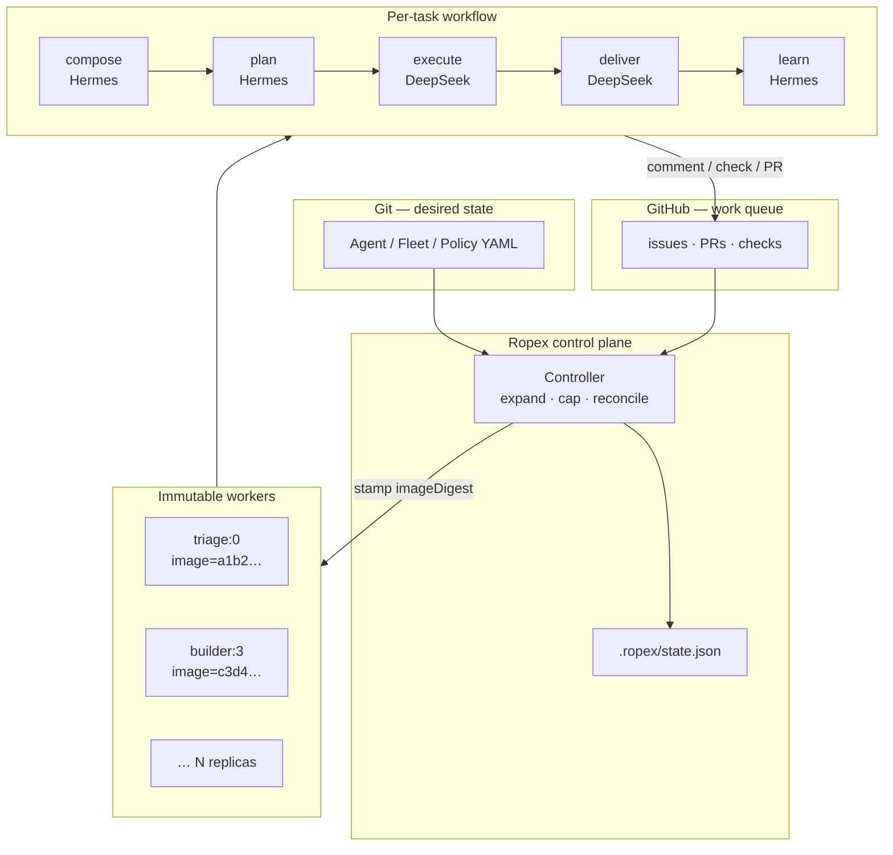

# Ropex

Git is the control plane. Agents are the workload. GitHub is the queue.

The name is from **RoPE** (rotary position embeddings) — the trick that lets a transformer keep many tokens in one coherent sequence. Ropex does the same for agents: one git sequence, many workers in position.

Ropex treats agents the way Kubernetes treats pods: you declare desired state in git, a controller derives workers, and they reconcile toward it. Each worker is **DeepSeek Harness** (everything is a plugin) plus **Hermes** (soul, memory, skills, a closed learning loop).

GitHub stops being a place humans dump work and starts being the API agents already speak: issues in, pull requests out.

## Why this exists

Coding agents today are single-player. You open a chat, one model loops on one repo, and scale means "buy more seats." That is the opposite of how software already ships.

- **DeepSeek Harness** already made the kernel composable: model, tools, loop, permissions, and even the agent loop are plugins (Cordis).
- **Hermes Agent** already made the brain durable: named bots, memory, skills that improve while they run, scheduled work.
- **GitOps** already showed how to run *huge* numbers of identical workloads from a repo: declare replicas, select targets, cap with policy, reconcile drift.

Ropex is the missing control plane that multiplies those two runtimes across GitHub the way Fleet/Flux multiplied Kubernetes across clusters.



Scale is a git commit: change `spec.replicas` from `20` to `2000`. The controller creates workers. Policy caps blast radius. No dashboard required.

## Quick start

```sh
npm install
npm test
npx tsx src/cli.ts demo --root /tmp/ropex-demo
npx tsx src/cli.ts apply fleets/examples
npx tsx src/cli.ts status
npx tsx src/cli.ts webhook simulate issues.opened --repo acme/app --title "login is broken" --secret test
npx tsx src/cli.ts drain --concurrency 2
npx tsx src/cli.ts metrics --prometheus
npx tsx src/cli.ts health
npx tsx src/cli.ts trajectories --jsonl
npx tsx src/cli.ts ui
```

`apply` reads YAML, expands fleets, applies policy, and writes `.ropex/state.json`. That local store is a stand-in for a real cluster; the contract is the same.

Soul / skills / harness edits change the **agent image digest** → reconcile retires the old worker and boots a new one (hot-reload via immutable roll, not in-place mutate).

## Manifests

```yaml
apiVersion: ropex.dev/v1
kind: Fleet
metadata:
  name: pr-factory
spec:
  replicas: 20
  template:
    spec:
      harness:
        profile: code          # DeepSeek: standard | code | minimal | creator
        model: deepseek-v4-pro
        plugins: [github, fs, shell]
      hermes:
        soul: souls/builder.md
        memory: shared          # sqlite | none | shared
        share:
          read: [agent, fleet]
          write: agent
        learning: true
        skills: [implement-issue, open-pr]
      github:
        events: [issues.labeled]
        deliver: pull_request
      selector:
        matchLabels:
          org: acme
```

Kinds:

| Kind | Role |
| --- | --- |
| `GitRepo` | Where the controller pulls desired state |
| `Agent` | One named worker type (Hermes bot + harness profile) |
| `Fleet` | Replica set of agents, selected onto repos |
| `Policy` | Max replicas and permission denylist |

## Runtime split

**Hermes** plans: soul + skills + **MemoryPort** decide *what* to do and learn from the trajectory.

**DeepSeek Harness** executes: a plugin kernel runs the loop (`tool-calls` or Code-mode collapsed program), tools, permissions, session, memory/skills/soul plugins, and GitHub delivery.

**Shared memory** is scoped (`worker` | `agent` | `fleet` | `cluster`) with a read/write policy on `hermes.share`. Replicas of the same agent share agent-scoped facts; fleets can opt into fleet-scoped facts. Contracts live in `src/contracts.ts`; the store is `src/memory.ts`.

Neither is a wrapper slogan. `src/plugins.ts` is a Cordis-shaped kernel. `src/hermes.ts` is the learn-loop. `src/runtime.ts` is the glue. `src/controller.ts` is the GitOps reconciler. `src/api.ts` + `src/ui/` are the control-plane view (`ropex ui`).

## GitHub as the agent OS

1. Human (or another agent) opens an issue.
2. Controller matches `github.events` + label selectors.
3. An idle worker runs the task.
4. Delivery plugin writes a comment, check, or pull request.
5. If Hermes learning is on, a skill is persisted for the next replica.

GitHub already has auth, review, CI, and blame. Ropex uses that instead of inventing another agent console.

See [architecture](./docs/architecture.md) for the Kubernetes analogy, image digests, and workflow ownership.

## Status

Control plane today (local, network-free tests):

| Capability | Status |
| --- | --- |
| Immutable workers + image digests | shipped |
| Hermes plan / learn + DeepSeek execute / deliver | shipped |
| Scoped shared memory + contracts + UI | shipped |
| Worktrees, fair queue, concurrent drain | shipped |
| HMAC webhooks + rate limit | shipped |
| Policy admission + fan-out | shipped |
| Journal, skills, metrics, trajectories | shipped |
| Worker health probes + backlog SLO | shipped |
| Dead-letter + retry queue | shipped |
| Claim leases + reclaim | shipped |
| Event-sourced audit trail | shipped |
| Multi-repo GitRepo sync + health UI | shipped (no remote clone yet) |
| Worker-pool autoscaler (GitOps YAML) | shipped |
| Control-plane tick + clone contract | shipped (remote clone stub) |
| Policy budget / cost accounting | shipped |
| Canary digest rolls + snapshots | shipped |
| Outbound webhook stub + cordon/evict | shipped |
| Placement require/prefer + taints | shipped |
| Config drift detector | shipped |
| Queue latency + fairness metrics | shipped |
| Drift + fairness UI panels | shipped |
| Skill promote / versions CLI | shipped |
| Workflow stage trajectory metrics | shipped |
| Chaos invariants + budget/policy UI | shipped |
| Clone progress + outbound UI | shipped |
| Worktree GC + webhook idempotency + priority aging | shipped |
| Queue pause/resume + sticky affinity + tick hooks | shipped |
| Pause/affinity/dsh UI + live scaffold docs | shipped |
| Snapshot restore + hermes seam + approval UI | shipped |
| GitRepo local watch/sync | shipped (no remote clone yet) |
| Live `@deepseek-ai/dsh` / Hermes process | not yet |

See [architecture](./docs/architecture.md), [API](./docs/api.md), and [ideas](./docs/ideas.md).

## License

[AGPL-3.0-only](./LICENSE) — GNU Affero General Public License v3.

If you run a modified Ropex as a network service, you must offer the corresponding source to its users.
