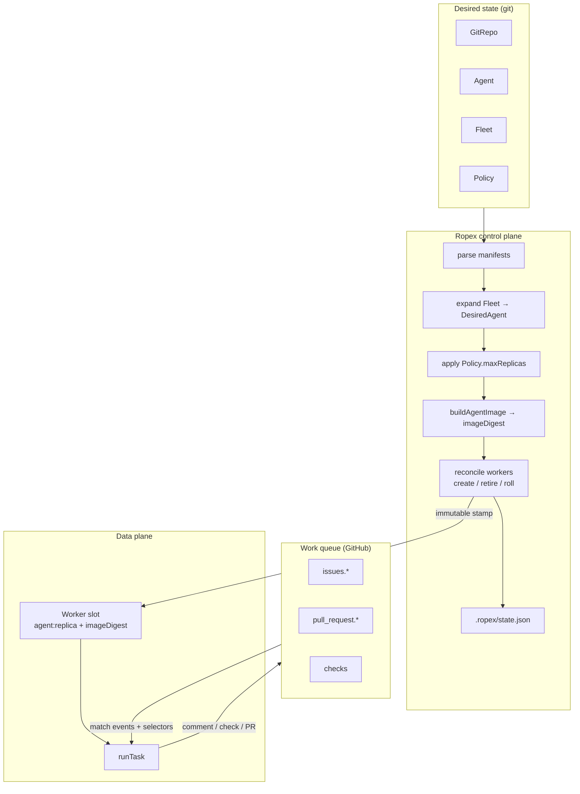
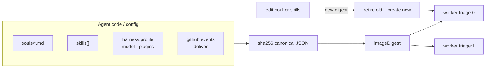
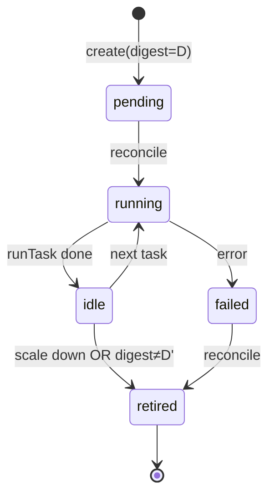
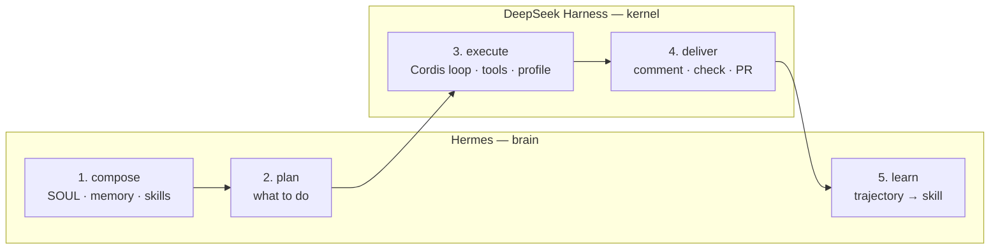
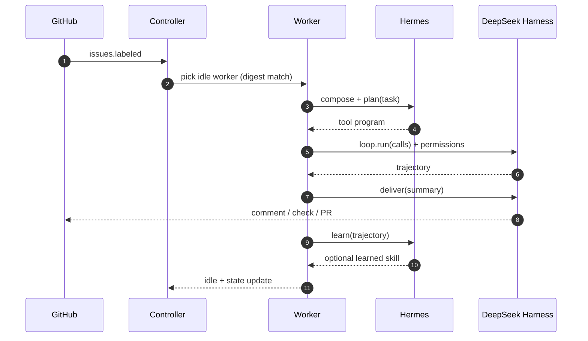

# Ropex architecture — Kubernetes for agents

Ropex is a GitOps orchestrator for agent fleets. Desired state lives in git. The controller derives **immutable workers** from agent code digests and runs a fixed **Hermes + DeepSeek Harness** workflow on each task.

## Big picture

## Control plane mapping

| Kubernetes | Ropex |
| --- | --- |
| Deployment / ReplicaSet | `Fleet` / `Agent` |
| Pod | Worker (one replica) |
| Container image digest | **Agent image digest** (soul + skills + harness + github) |
| etcd / cluster state | `.ropex/state.json` |
| Admission / ResourceQuota | `Policy` (maxReplicas + permission deny) |
| kubelet | Runtime (`runTask`) |
| Ingress / queue | GitHub events |

## Immutable agents (image = code state)

An **agent image** is a content-addressed snapshot of Hermes soul/memory/skills, DeepSeek profile/plugins/model, and GitHub delivery config.

`imageDigest = sha256(canonical payload)[:16]`

Reconcile rules:

1. Desired replicas grow → **create** workers stamped with the current digest.
2. Desired replicas shrink → **retire** excess workers.
3. Digest changes → **retire old + create new** under the same slot id (no in-place mutation of harness/plugins/model).
4. Learned skills ride along as a **volume** across rolls; they do not change the digest.

## Workflow — best of Hermes and DeepSeek

Ropex does not invent a third agent loop. It schedules a fixed pipeline that keeps each system's strongest attributes.

| Stage | Owner | Why |
| --- | --- | --- |
| `compose` | Hermes | SOUL / memory / skills are Hermes pillars |
| `plan` | Hermes | Brain decides *what* to do |
| `execute` | DeepSeek | Cordis loop + tools + profile (`tool-calls` / `code`) |
| `deliver` | DeepSeek | Delivery plugin → comment / check / PR |
| `learn` | Hermes | Distill trajectory → skill for the next replica |

### Task sequence

## Worker lifecycle

`pending → running → idle → (retired | failed)`

- Reconcile stamps `running` on create.
- `runTask` requires worker digest == desired image digest (drift fails closed).
- After a task, worker returns to `idle`.
- Spec shrink or image roll marks the old worker `retired` (kept in history).

## What is still simulated

Tools, delivery, memory backend, GitRepo watch, live `@deepseek-ai/dsh`, and live Hermes. The contracts above are the seams those live adapters plug into.

## License

Ropex is licensed under the [GNU Affero General Public License v3](../LICENSE) (`AGPL-3.0-only`).
