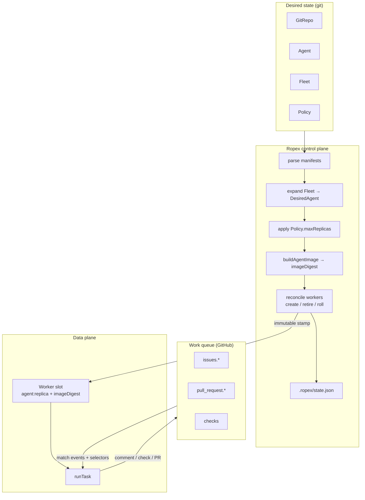
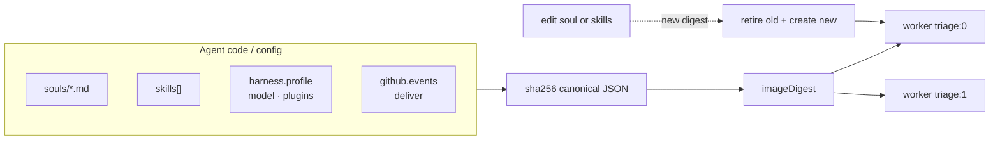
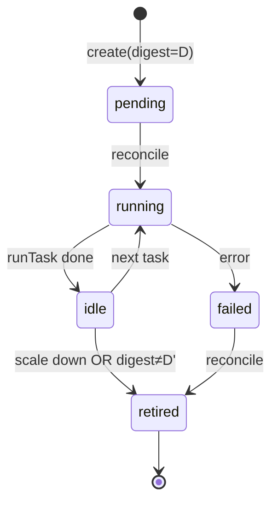
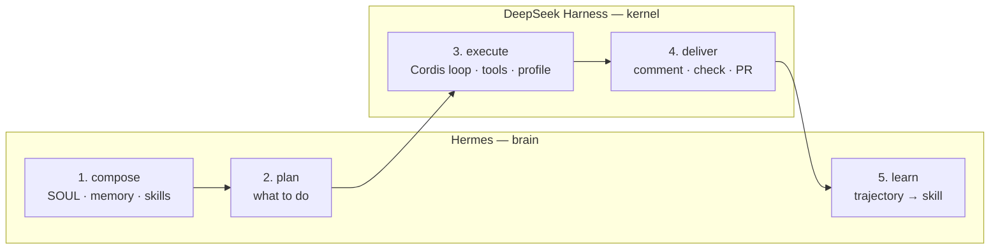
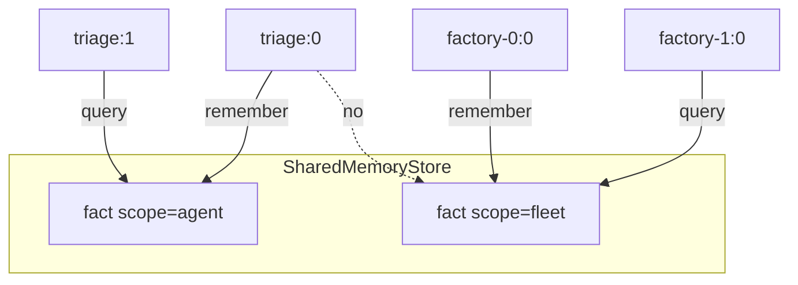
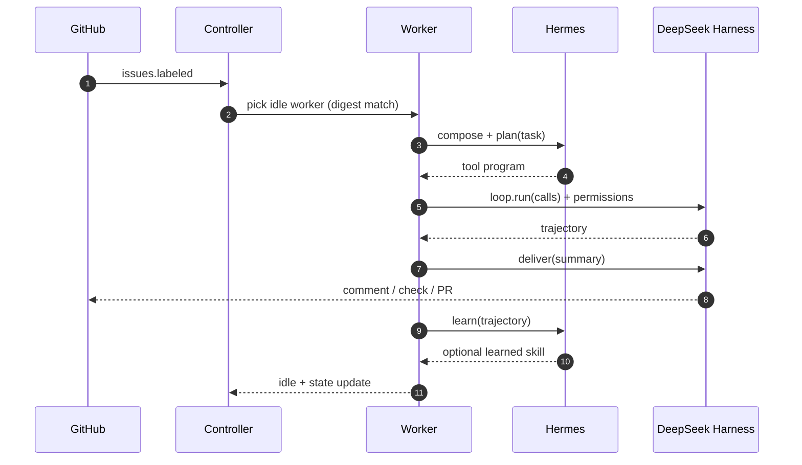
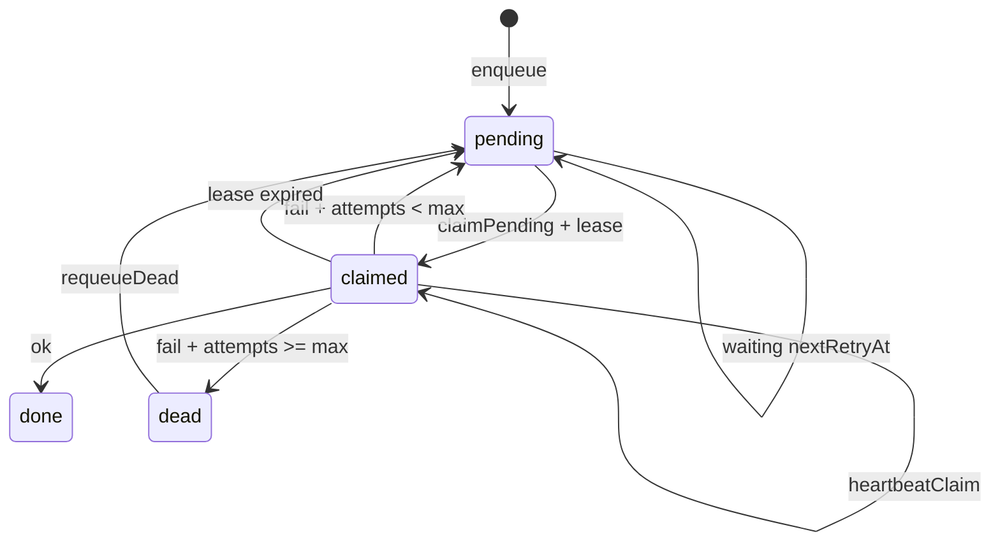
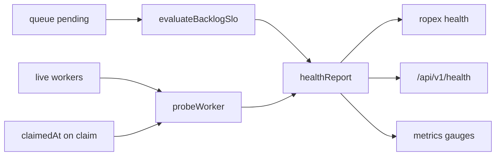

# Ropex architecture — Kubernetes for agents

Ropex is a GitOps orchestrator for agent fleets. Desired state lives in git. The controller derives **immutable workers** from agent code digests and runs a fixed **Hermes + DeepSeek Harness** workflow on each task.

## Big picture

## Control plane mapping

| Kubernetes | Ropex |
| --- | --- |
| Deployment / ReplicaSet | `Fleet` / `Agent` |
| Pod | Worker (one replica) |
| Container image digest | **Agent image digest** (soul + skills + harness + github) |
| etcd / cluster state | `.ropex/state.json` |
| Admission / ResourceQuota | `Policy` (maxReplicas + permission deny) |
| kubelet | Runtime (`runTask`) |
| Ingress / queue | GitHub events |

## Immutable agents (image = code state)

An **agent image** is a content-addressed snapshot of Hermes soul/memory/skills, DeepSeek profile/plugins/model, and GitHub delivery config.

`imageDigest = sha256(canonical payload)[:16]`

Reconcile rules:

1. Desired replicas grow → **create** workers stamped with the current digest.
2. Desired replicas shrink → **retire** excess workers.
3. Digest changes → **retire old + create new** under the same slot id (no in-place mutation of harness/plugins/model).
4. Learned skills ride along as a **volume** across rolls; they do not change the digest.

## Workflow — best of Hermes and DeepSeek

Ropex does not invent a third agent loop. It schedules a fixed pipeline that keeps each system's strongest attributes.

| Stage | Owner | Why |
| --- | --- | --- |
| `compose` | Hermes | SOUL / memory / skills are Hermes pillars |
| `plan` | Hermes | Brain decides *what* to do |
| `execute` | DeepSeek | Cordis loop + tools + profile (`tool-calls` / `code`) |
| `deliver` | DeepSeek | Delivery plugin → comment / check / PR |
| `learn` | Hermes | Distill trajectory → skill for the next replica |

## Shared memory

Facts live on a cluster bus with scopes. Hermes remembers through `MemoryPort`; DeepSeek mounts the same port as the `memory` plugin.

| Scope | Visible to |
| --- | --- |
| `worker` | Same worker id only |
| `agent` | All replicas of that agent |
| `fleet` | Workers derived from the same fleet |
| `cluster` | Every worker |

`hermes.share.read` / `hermes.share.write` set the policy (baked into the agent image digest). Defaults: `sqlite` → agent; `shared` → agent+fleet read / agent write; `none` → worker-local only.

Control-plane UI: `ropex ui` serves `src/ui` and `/api/v1/view` (Hermes + DeepSeek surfaces, memory rope, workers).

### Task sequence

## Worker lifecycle

`pending → idle → running → idle → (retired | failed)`

- Reconcile stamps **`idle`** on create (ready for work).
- Scheduler **claims** an idle worker → `running`, runs Hermes→DeepSeek, then back to `idle`.
- `runTask` requires worker digest == desired image digest (drift fails closed).
- Spec shrink or image roll marks the old worker `retired` (kept in history).
- Each live worker gets an isolated **worktree** under `sandbox/worktrees/`; retired workers tear it down.

## Work queue

GitHub webhooks (HMAC-verified), `github simulate`, and CLI enqueue into `ClusterState.queue`. `ropex drain` claims pending items onto LRU-idle workers and records metrics.

Failures **retry** with exponential backoff (`nextRetryAt`, default 3 attempts), then land in the **dead-letter** lane (`status: dead`). `ropex retry <id>|--all` re-queues DLQ items. Transient task errors release the worker back to `idle` so capacity is not burned.

**Claim leases:** each claim gets `leaseExpiresAt` (default 5m). `heartbeatClaim` extends it while work runs; `reclaimExpiredLeases` / `ropex reclaim` (also auto on drain) treats expiry as a soft failure → retry/DLQ.

## GitRepo watch

`ropex watch <path> [--once] [--interval 5s]` re-reads local manifest trees and reconciles — Flux-style drift control without a remote clone (yet). Scale or skill edits produce create/retire/image rolls.

## Multi-repo sync

`ropex sync` unions **all** declared `GitRepo` local paths into one reconcile so agents from repo A are not wiped when syncing repo B. `ropex sync --due` skips when every repo’s `interval` has not elapsed (`gitRepoStatus.lastSyncedAt`). Missing paths are reported; remote clone remains open.

## Autoscaler (GitOps)

`ropex autoscale` / `/api/v1/autoscale` emit **replica YAML recommendations** from backlog depth, idle/running workers, and `Policy.maxReplicas`. Ropex never writes replicas into live state — commit the YAML so git stays the source of truth (same contract as `ropex scale`).

## Control-plane tick

`ropex tick` runs one heartbeat: reclaim expired leases → due multi-repo sync → drain → autoscale recommend. Cron-friendly; network-free.

## GitRepo clone contract

`ropex clone` materializes declared repos: existing `spec.path` or `file://` copy succeed; `https`/`git` fail closed until a live cloner is wired (`remote-stub`).

## Policy simulation

`ropex policy simulate` dry-runs admission across all desired agents (fleet report).

## Budget accounting

Optional `Policy.spec.budget` (`maxUnits`, `windowMs`, `scope: cluster|fleet|agent`) tracks abstract task units (weighted by harness profile). Exhausted budgets deny enqueue. `ropex budget`, `/api/v1/budget`, Prometheus `budget_spent` / `budget_limit`.

## Canary digest rolls

`ropex apply --canary [--canary-count N]` rolls only N mismatch slots per agent per reconcile (default 1). Holdouts keep the old digest; the scheduler prefers digest-matching idle workers. Re-apply to continue the rollout. `ropex snapshot` checkpoints `.ropex/state.json`.

## Cordon / evict + outbound delivery

`ropex cordon` / `uncordon` / `evict` control scheduling. `ropex deliver <id> --stub` records an outbound webhook intent (live HTTPS fails closed). See [api.md](./api.md).

## Placement + drift

`Agent.spec.placement` (`require` / `prefer` / `taints` / `tolerations`) gates and scores claims. Workers carry `labels` (from metadata) and `taints`. Placement is part of the agent image digest. `ropex drift [path]` and `GET /api/v1/drift` report missing/extra/digest/replica/label/taint/cordoned findings without writing state (complements `ropex diff`).

## Fairness + queue latency

`ropex fairness` / `GET /api/v1/fairness` derive claim-wait and run-duration percentiles from queue timestamps, plus idle skew (`lastTaskAt`) and claim-count CV. Prometheus: `ropex_claim_wait_*`, `ropex_run_duration_*`, `ropex_fairness_*`. Drift and fairness also appear on `GET /api/v1/view` and the control-plane UI.

## Skill promote + workflow stage metrics

`ropex skills promote <name>` shares the latest registry version with every desired agent; `versions` lists history. Trajectories persist `stages` from the run workflow; Prometheus counters `ropex_workflow_{compose,plan,execute,deliver,learn}_total`.

## Observability

- **Delivery journal** — every comment/check/PR appends to `state.deliveries` (`ropex journal`).
- **Audit trail** — event-sourced control-plane log (`state.audit`): reconcile, enqueue, claim, complete, retry, dead, reclaim, webhook, approval, sync. Cap 5k. `ropex audit [--kind] [--jsonl]`, `/api/v1/audit`.
- **Skill registry** — versioned skills with `shareSkill` across agents (`ropex skills`).
- **Metrics** — JSON or Prometheus text (`ropex metrics --prometheus`, `/api/v1/metrics`), including backlog age and unhealthy worker gauges.
- **Health / SLO** — `ropex health` and `/api/v1/health` probe live workers (digest, worktree, stuck claim) and evaluate backlog depth/age SLOs. Unhealthy or breached → HTTP 503 / exit 1.

## DeepSeek adapter seam

`bootDsh(spec)` loads a **profile pack** (`minimal` | `code` | `standard` | `creator`) and runs Hermes plans through it. `backend: "simulated"` today; `backend: "live"` is reserved for `@deepseek-ai/dsh`.

## Parallel drain + GitRepo sync

- `ropex drain --concurrency N` runs claimed tasks in parallel batches.
- `ropex sync` reconciles declared `GitRepo` local paths (clone still open).
- `ropex replay <id>` re-appends a delivery with `[replay]`.
- `ropex demo` runs apply → HMAC webhook → concurrent drain offline.

## Overnight control-plane stack (2026-08-21 → 22)

Shipped end-to-end offline:

| Layer | Modules |
| --- | --- |
| Desired state | `fleets/**`, `spec`, `controller`, `image`, `worktree` |
| Ingress | `webhook` (HMAC), `ratelimit`, `github` |
| Schedule | fair LRU `queue`, concurrent `scheduler`, priority, retry/DLQ, `fanout` |
| Brain / kernel | Hermes compose/plan/learn, `bootDsh` profile packs |
| Governance | `admission`, `approval`, `policy` dry-run |
| Memory / skills | scoped `SharedMemoryStore`, versioned `skillRegistry` |
| Observability | journal, trajectories, metrics, health/SLO, **audit** |
| Surfaces | CLI, `/api/v1/*`, `ropex ui` |

Still open for live adapters: remote GitRepo clone, `@deepseek-ai/dsh`, Hermes process.

## What is still simulated

Tools, delivery, memory backend, GitRepo watch, live `@deepseek-ai/dsh`, and live Hermes. The contracts above are the seams those live adapters plug into.

## License

Ropex is licensed under the [GNU Affero General Public License v3](../LICENSE) (`AGPL-3.0-only`).
