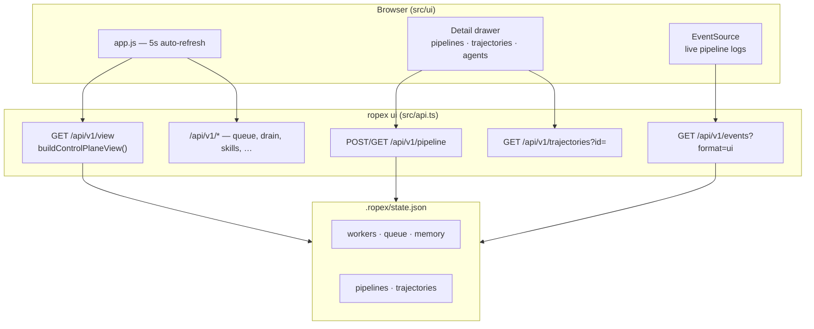

# Control-plane UI

`ropex ui` serves a static dashboard and the full `/api/v1/*` API on one port (default **7780**).

```bash
ropex apply fleets/examples/github-control-plane.yaml
ropex ui
# → http://127.0.0.1:7780
# → http://127.0.0.1:7780/api/v1/view
```

The UI is an **operations and observability** surface — not a chat agent. It shows fleet health, queue state, Hermes/DeepSeek configuration, executor pipelines, and trajectories. For conversational orchestration, use [Magentic](../integrations/magentic/README.md) against the [executor API](./executor-api.md).

## Architecture



## Navigation map

| Section | Hash | Purpose |
| --- | --- | --- |
| Workflow | `#workflow` | Fixed compose→plan→execute→deliver→learn pipeline |
| Memory | `#memory` | Scoped facts; sync/export from git |
| Tasks | `#tasks` | Forge-neutral Task YAML inbox |
| Workers | `#workers` | Live replicas, digests, harness profile |
| Health | `#health` | Probes + backlog SLO |
| Hygiene / Drift / Fairness | `#hygiene` … | Ops panels |
| Queue | `#queue` | Pending work, pause, drain concurrency |
| **Pipelines** | `#pipelines` | Executor API runs — submit, drain, drill-down |
| Trajectories | `#trajectories` | Hermes→DeepSeek run history |
| Harness | `#dsh` | DeepSeek profile packs + live/simulated status |
| Hermes & DeepSeek | `#surfaces` | Per-agent brain + harness config |
| Deliveries / Audit | `#journal` … | Journal and event trail |

## Deep-dive drawer

Click rows or agent cards to open a slide-over panel (Escape or **Close** to dismiss).

### Pipelines

1. Enter a prompt in the Pipelines form → **Run**
2. Drawer opens with **live SSE** from `/api/v1/events?pipelineId=…&format=ui`
3. Shows stage list, persisted events, and final output when done

Click any pipeline row (or **view**) to reopen a completed run without SSE.

### Trajectories

After `ropex drain` completes tasks, trajectories appear under **Trajectories**. Click a row to see:

- Hermes **plan** steps
- DeepSeek **trajectory** (thought / tool calls / observation per step)
- Final **output**

API: `GET /api/v1/trajectories?id=<trajectory-id>`

### Agent surfaces

Under **Hermes & DeepSeek**, click any agent card for:

- Hermes: soul path, memory backend, share policy, skills, learning flag
- DeepSeek: profile, loop mode, model, plugins, tools
- Matching worker slot (if live)

## Live vs simulated backends

The **Harness** section shows backend readiness:

| Component | Default | Live requires |
| --- | --- | --- |
| Hermes brain | `simulated` (`createHermes()`) | `ROPEX_HERMES_BACKEND=live`, `hermes-agent` |
| DeepSeek harness | `simulated` (`bootDsh()`) | `ROPEX_DSH_BACKEND=live`, `@deepseek-ai/dsh`, **`OPENAI_API_KEY`** (preferred) or `DEEPSEEK_API_KEY` |

The control plane itself is always **live** (real state, real drain). Agent backends stay simulated in CI and offline demos.

See [hermes.md](./hermes.md) and [dsh.md](./dsh.md) for wiring checklists.

## Operator actions from UI

| Action | API |
| --- | --- |
| Refresh view | `GET /api/v1/view` (also auto every 5s) |
| Pause / resume queue | `POST /api/v1/queue` `{ action: "pause" \| "resume" }` |
| Drain | `POST /api/v1/drain` `{ concurrency }` |
| Set drain preference | `PUT /api/v1/drain` `{ concurrency }` |
| Approve / reject tool | `POST /api/v1/approvals` |
| Promote skill | `POST /api/v1/skills` `{ action: "promote", name }` |
| Run hygiene | `POST /api/v1/hygiene` `{ action: "all" }` |
| Memory sync | `POST /api/v1/memory` (sync actions) |
| Submit pipeline | `POST /api/v1/pipeline` `{ prompt, drain: true }` |

## Environment

| Variable | Effect |
| --- | --- |
| `--port N` | UI port (default 7780) |
| `ROPEX_PIPELINE_PLANNER` | `heuristic` (default) or `hermes` for pipeline planning |
| `ROPEX_HERMES_BACKEND` | `simulated` \| `live` |
| `ROPEX_DSH_BACKEND` | `simulated` \| `live` |
| `OPENAI_API_KEY` | Preferred live LLM key |
| `DEEPSEEK_API_KEY` | Optional live LLM key fallback |

## What the UI is not

- **Not** a Hermes chat or DeepSeek coding session — use live adapters or Magentic for that
- **Not** a fleet editor — change `fleets/**/*.yaml` and `ropex apply`
- **Not** authenticated — local control plane only; add auth before exposing publicly

## Related

- [Executor API](./executor-api.md) — pipeline contract Magentic uses
- [API reference](./api.md) — full route list
- [Architecture](./architecture.md) — how workers and queue connect
