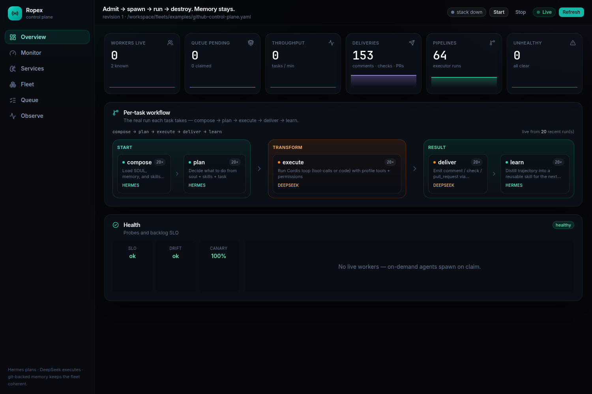
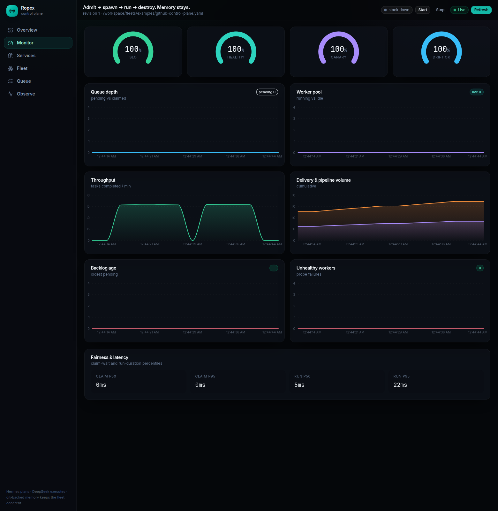
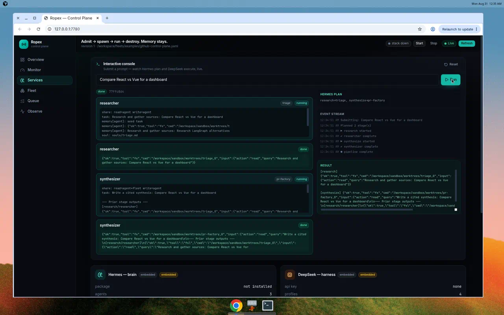
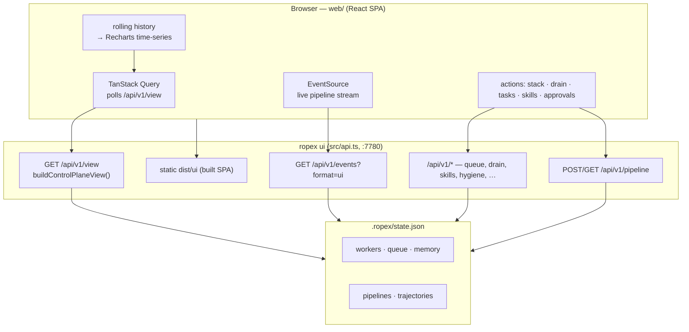

# Control-plane UI

`ropex ui` serves a **modern single-page dashboard** and the full `/api/v1/*` API on one port (default **7780**).

```bash
npm run up
# or:
ropex up fleets/examples/github-control-plane.yaml --serve
# → http://127.0.0.1:7780
# → http://127.0.0.1:7780/api/v1/view
```

See [operations.md](./operations.md) for Podman Compose and stack CLI.



## Tech stack

The dashboard is a **Vite + React 19 + TypeScript** app (source in [`web/`](../web)):

| Concern | Library |
| --- | --- |
| Build | Vite 8 |
| UI | React 19 + Tailwind CSS v4 |
| Charts | Recharts (time-series, radial gauges) |
| Data | TanStack Query (polls `/api/v1/view`), native `EventSource` for SSE |
| Icons | lucide-react |

`npm run build` builds the SPA into `dist/ui`; the control-plane server (`resolveUiDir` in `src/api.ts`) serves it in dev (`ropex ui`) and prod. During UI development, `npm run web:dev` runs the Vite dev server with `/api` proxied to `:7780`.

The UI is an **operations and observability** surface — not a chat agent. A left sidebar switches views; tabs are deep-linkable via the URL hash (`#monitor`, `#services`, …).

## Top bar

| Control | Action |
| --- | --- |
| **Start** | `POST /api/v1/stack` `{ action: "up" }` — apply fleet, resume queue, drain |
| **Stop** | `POST /api/v1/stack` `{ action: "down" }` — pause queue, sweep workers |
| **stack pill** | Shows the current stack status (run / paused / …) |
| **Live pill** | Teal pulse — TanStack Query auto-refreshes `/api/v1/view` |
| **Refresh** | Manual re-fetch |

## Views

| View | Hash | Contents |
| --- | --- | --- |
| **Overview** | `#overview` | KPI cards with live sparklines, the real per-task workflow flow, health |
| **Monitor** | `#monitor` | Grafana-style live time-series + radial gauges (see below) |
| **Services** | `#services` | Hermes + DeepSeek status and an interactive streaming console |
| **Fleet** | `#fleet` | Workers by agent, native task submit, hygiene heatmap, skills, canary/drift, memory |
| **Queue** | `#queue` | Drain controls, pipelines, approvals, policy simulate |
| **Observe** | `#observe` | Trajectories, deliveries, rate limits, audit trail |

### Overview

- **KPI cards** with sparklines: workers live, queue pending, throughput (tasks/min), deliveries, pipelines, unhealthy.
- **Per-task workflow flow** — the real run each task takes, rendered from `GET /api/v1/view`.workflow: the ordered stages `compose → plan → execute → deliver → learn` grouped onto the **Start · Transform · Result** phase spine, each stage attributed to its owner (Hermes / DeepSeek) and annotated with how many recent trajectories ran it. The phase of any in-flight pipeline is highlighted.
- **Health** — SLO / drift / canary tiles plus a live worker probe list.

### Monitor (Grafana-style)



The client samples `/api/v1/view` into a rolling in-memory history and renders live charts:

- **Radial gauges:** SLO, healthy workers, canary coverage, drift.
- **Time-series:** queue depth (pending vs claimed), worker pool (running vs idle), throughput (tasks/min), delivery & pipeline volume, backlog age, unhealthy workers.
- **Fairness & latency:** claim-wait and run-duration percentiles.

### Services — Hermes ↔ DeepSeek console



The **interactive console** submits a prompt and streams the run stage-by-stage over SSE:

1. Type a prompt → **Run** → `POST /api/v1/pipeline` `{ drain: false }`, then a scoped `{ action: "drain" }`.
2. `EventSource(/api/v1/events?pipelineId=…&format=ui)` streams the plan and stage events.
3. The panel shows the **Hermes plan**, live **stage cards** (running → done), an **event stream**, and the terminal **result**.

Below the console, **service cards** show Hermes and DeepSeek backend status (embedded vs live, package/API-key readiness) and per-agent **surfaces** (Hermes soul/skills/memory/share; DeepSeek profile/model/plugins/tools).

## Data flow



## Live vs embedded backends

The **Services** view shows backend readiness:

| Component | Default | Live requires |
| --- | --- | --- |
| Hermes brain | `embedded` (`createHermes()`) | `ROPEX_HERMES_BACKEND=live`, `hermes-agent` |
| DeepSeek harness | `embedded` (`bootDsh({ hermes })`) | `ROPEX_DSH_BACKEND=live`, `@deepseek-ai/dsh`, **`OPENAI_API_KEY`** (preferred) or `DEEPSEEK_API_KEY` |

`bootDsh` always requires a Hermes brain — plan and execute are coupled in every environment, including tests. See [hermes.md](./hermes.md) and [dsh.md](./dsh.md).

## Operator actions from UI

| Action | API |
| --- | --- |
| Start / stop stack | `POST /api/v1/stack` `{ action: "up" \| "down" }` |
| Refresh view | `GET /api/v1/view` (auto via TanStack Query) |
| Pause / resume queue | `POST /api/v1/queue` `{ action: "pause" \| "resume" }` |
| Drain | `POST /api/v1/drain` `{ concurrency }` |
| Set drain preference | `PUT /api/v1/drain` `{ concurrency }` |
| Submit native task | `POST /api/v1/tasks` `{ action: "submit", agent, prompt, delivery }` |
| Approve / reject tool | `POST /api/v1/approvals` |
| Promote skill | `POST /api/v1/skills` `{ action: "promote", name }` |
| Run hygiene | `POST /api/v1/hygiene` `{ action }` |
| Memory sync | `POST /api/v1/memory` `{ action: "sync" }` |
| Submit / stream pipeline | `POST /api/v1/pipeline` + `GET /api/v1/events` |

## Environment

| Variable | Effect |
| --- | --- |
| `--port N` | UI port (default 7780) |
| `ROPEX_PIPELINE_PLANNER` | `heuristic` (default) or `hermes` for pipeline planning |
| `ROPEX_HERMES_BACKEND` | `embedded` \| `live` |
| `ROPEX_DSH_BACKEND` | `embedded` \| `live` |
| `OPENAI_API_KEY` | Preferred live LLM key |
| `DEEPSEEK_API_KEY` | Optional live LLM key fallback |

## What the UI is not

- **Not** a Hermes chat or DeepSeek coding session — use live adapters or Magentic for that
- **Not** a fleet editor — change `fleets/**/*.yaml` and `ropex apply`
- **Not** authenticated — local control plane only; add auth before exposing publicly

## Related

- [Executor API](./executor-api.md) — pipeline contract the console uses
- [API reference](./api.md) — full route list
- [Architecture](./architecture.md) — how workers and queue connect
