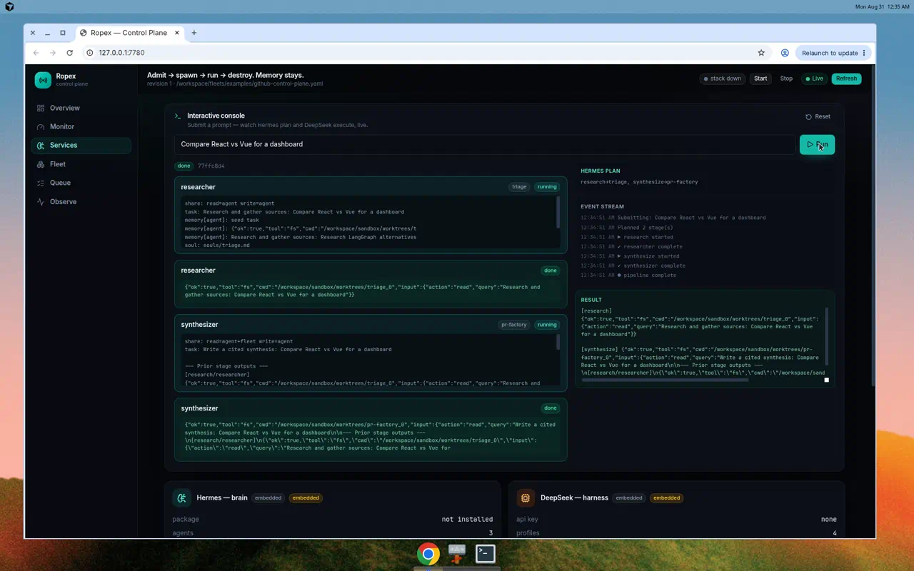
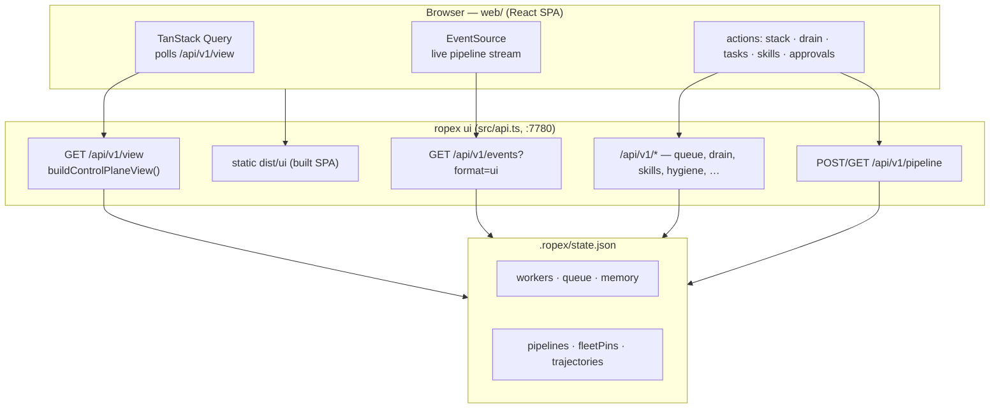

# Control-plane UI

`ropex ui` serves a **modern single-page dashboard** and the full `/api/v1/*` API on one port (default **7780**).

```bash
npm run up
# or:
ropex up fleets/examples/github-control-plane.yaml --serve
# → http://127.0.0.1:7780
# → http://127.0.0.1:7780/api/v1/view
```

See [operations.md](./operations.md) for Podman Compose and stack CLI. Live Hermes + DeepSeek on the host: `npm run live` ([quickstart.md](./quickstart.md)).


## Tech stack

The dashboard is a **Vite + React 19 + TypeScript** app (source in [`web/`](../web)):

| Concern | Library |
| --- | --- |
| Build | Vite 8 |
| UI | React 19 + Tailwind CSS v4 |
| Data | TanStack Query (polls `/api/v1/view`), native `EventSource` for SSE |
| Icons | lucide-react |

`npm run build` builds the SPA into `dist/ui`; the control-plane server (`resolveUiDir` in `src/api.ts`) serves it in dev (`ropex ui`) and prod. During UI development, `npm run web:dev` runs the Vite dev server with `/api` proxied to `:7780`.

The UI follows a plan. It is not a chat agent and it does not chart an idle cluster. A left sidebar switches views. Tabs stay deep-linkable: `#overview` is Now, `#services` is Run, `#queue` is Plans, `#fleet` is Fleet, `#observe` is Results. An old `#monitor` link opens Now.

## Top bar

| Control | Action |
| --- | --- |
| **Start** | `POST /api/v1/stack` `{ action: "up" }` — apply fleet, resume queue, drain |
| **Stop** | `POST /api/v1/stack` `{ action: "down" }` — pause queue, sweep workers |
| **stack pill** | Shows the current stack status (run / paused / …) |
| **Live pill** | Teal pulse — TanStack Query auto-refreshes `/api/v1/view` |
| **Refresh** | Manual re-fetch |

## Views

| View | Hash | What it answers |
| --- | --- | --- |
| **Now** | `#overview` | Where the latest plans are, and whether the session is still open |
| **Run** | `#services` | Ask something, then follow Hermes handing each step to DeepSeek |
| **Plans** | `#queue` | Did this prompt reuse a pinned fleet or mint one, and which agents ran |
| **Fleet** | `#fleet` | The agents you can reuse, the pin the next matching prompt will pick, and the memory that stayed |
| **Results** | `#observe` | What a finished plan produced: trajectories and deliveries |

A **Needs attention** strip appears on Now only when a worker is unhealthy, the queue is paused, a single-agent task is dead, or an approval is waiting.

### Now

**Where a plan runs** comes from `placement` on `GET /api/v1/view`. `placement.executor` is `container` or `inprocess`. In container mode each recent plan is a card named `ropex-session:<id>`: the steps that shared that container (`look → triage`, `check → reviewer`), a `reuse` or `mint` badge for the fleet binding, and whether the session is open, deleted, or not started. The control-plane column keeps Hermes memory (fact count, plan count, live vs embedded backends). The scale column is live workers against `Policy.maxReplicas` and each agent's `maxConcurrent`.

A session card is teal only while a step status is `running`. A pipeline whose status is `running` but whose steps are still `pending` is labeled **not started**. Finished container plans are **session deleted**. Memory was copied back before the image was removed. See [ephemeral sessions](./ephemeral-sessions.md).

### Plans


One row is one interaction. The badge is `reuse <fleet>` or `mint <fleet>`. Chips are `step → agent`. The session label is open, deleted, or not started. Failed single-agent tasks (not plans) get a retry row. Pause, drain, and policy simulate stay behind **Queue controls**.

### Run — follow Hermes and DeepSeek


The **Follow** strip sits above the stage cards. It is the live handoff:

| Lane | Lights up when | Beats |
| --- | --- | --- |
| Hermes | `plan`, `learn` | compose line, plan thoughts, "remembered on the control plane" |
| DeepSeek harness | `execute`, `deliver` | thought, tool, observation, delivery |

The token along the top is `plan → execute → deliver → learn`. The right-hand label is the step and phase that are current (`check · learn`). Each lane keeps the last four beats. Container runs emit the log in one burst when the session exits; the page reveals one beat at a time so you can follow it. In-process runs appear as the control plane emits them.

**Simple pipeline** is the one-click smoke test: triage writes one sentence (`look`), reviewer marks it PASS or FAIL (`check`). Both steps share one session when `ROPEX_EXECUTOR=container`.



The console submits a prompt and streams the run over SSE:

1. **Simple pipeline** or **Run prompt** → `POST /api/v1/pipeline` `{ drain: false }`, then a scoped `{ action: "drain" }`. Simple pipeline sends `simple: true`, which pins triage and reviewer.
2. `EventSource(/api/v1/events?pipelineId=…&format=ui)` streams the plan and stage events. A plan event includes `fleet` and `fleet_mode`.
3. The panel shows the **Hermes plan**, live **stage cards** (running → done), an **event stream**, and the terminal **result**.

Badges above the prompt show the Hermes backend, the DeepSeek backend, and the loaded agents. A Claude Code, Codex, or Copilot card appears only when that runtime is ready. Agent souls, pins, and memory live on **Fleet**.

### Fleet

Pins come from `fleetPins` on the view: the fleet name, the agents, and the prompt that will reuse them. Under that, each loaded agent shows its model, skills, and whether a worker is running. Memory facts are the ones copied back before the session was deleted. Skills can be promoted. Pool hygiene and canary coverage stay under **Maintenance**.

### Results

Trajectories are the steps Hermes handed to DeepSeek. Deliveries are comments, checks, and pull requests a plan sent. Rate-limit buckets appear only when one is active.

## Data flow


```mermaid
flowchart TB
  subgraph Browser["Browser — web/ (React SPA)"]
    Q["TanStack Query\npolls /api/v1/view"]
    SSE["EventSource\nlive pipeline stream"]
    ACT["actions: stack · drain · tasks · skills · approvals"]
  end

  subgraph Server["ropex ui (src/api.ts, :7780)"]
    VIEW["GET /api/v1/view\nbuildControlPlaneView()"]
    PIPE["POST/GET /api/v1/pipeline"]
    EV["GET /api/v1/events?format=ui"]
    REST["/api/v1/* — queue, drain, skills, hygiene, …"]
    STATIC["static dist/ui (built SPA)"]
  end

  subgraph State[".ropex/state.json"]
    W["workers · queue · memory"]
    P["pipelines · fleetPins · trajectories"]
  end

  Q --> VIEW --> State
  SSE --> EV --> State
  ACT --> REST --> State
  ACT --> PIPE --> State
  Browser --> STATIC
```

## Live vs embedded backends

The **Run** tab shows backend readiness:

| Component | Default | Live requires |
| --- | --- | --- |
| Hermes brain | `embedded` (`createHermes()`) | `ROPEX_HERMES_BACKEND=live`, `hermes-agent` |
| DeepSeek harness | `embedded` (`bootDsh({ hermes })`) | `ROPEX_DSH_BACKEND=live`, `@deepseek-ai/dsh`, **`OPENAI_API_KEY`** (preferred) or `DEEPSEEK_API_KEY` |
| Claude Code / Codex / Copilot | not installed | CLI on `PATH` plus that runtime's credentials — see [worker-runtimes.md](./worker-runtimes.md) |

`bootWorker` always requires a Hermes brain — plan and execute are coupled in every environment, including tests. `dsh` is the default execute stage; other kinds are declared on `spec.runtime`. Operator steps: [quickstart.md](./quickstart.md). See [hermes.md](./hermes.md), [dsh.md](./dsh.md), and [worker-runtimes.md](./worker-runtimes.md).

## Operator actions from UI

| Action | API |
| --- | --- |
| Start / stop stack | `POST /api/v1/stack` `{ action: "up" \| "down" }` |
| Refresh view | `GET /api/v1/view` (auto via TanStack Query) |
| Pause / resume queue | `POST /api/v1/queue` `{ action: "pause" \| "resume" }` |
| Drain | `POST /api/v1/drain` `{ concurrency }` |
| Set drain preference | `PUT /api/v1/drain` `{ concurrency }` |
| Submit native task | `POST /api/v1/tasks` `{ action: "submit", agent, prompt, delivery }` |
| Approve / reject tool | `POST /api/v1/approvals` |
| Promote skill | `POST /api/v1/skills` `{ action: "promote", name }` |
| Run hygiene | `POST /api/v1/hygiene` `{ action }` |
| Memory sync | `POST /api/v1/memory` `{ action: "sync" }` |
| Submit / stream pipeline | `POST /api/v1/pipeline` + `GET /api/v1/events` |

## Environment

| Variable | Effect |
| --- | --- |
| `--port N` | UI port (default 7780) |
| `ROPEX_PIPELINE_PLANNER` | `heuristic` (default) or `hermes` for pipeline planning |
| `ROPEX_HERMES_BACKEND` | `embedded` \| `live` |
| `ROPEX_DSH_BACKEND` | `embedded` \| `live` |
| `OPENAI_API_KEY` | Preferred live LLM key. Forwarded into a session; not copied into the image |
| `DEEPSEEK_API_KEY` | Optional live LLM key fallback |
| `ROPEX_EXECUTOR` | `container` runs each plan as `ropex-session:<id>`. Unset stays in-process |
| `ROPEX_WORKER_IMAGE` | Base image for that session (default `ropex-worker:latest`) |
| `ROPEX_CONTAINER_BIN` | `docker` or `podman`. Unset picks Docker, then Podman |

## What the UI is not

- **Not** a Hermes chat or DeepSeek coding session — use live adapters or Magentic for that
- **Not** a fleet editor — change `fleets/**/*.yaml` and `ropex apply`
- **Not** authenticated — local control plane only; add auth before exposing publicly

## Related

- [Executor API](./executor-api.md) — pipeline contract the console uses
- [API reference](./api.md) — full route list
- [Architecture](./architecture.md) — how workers and queue connect
