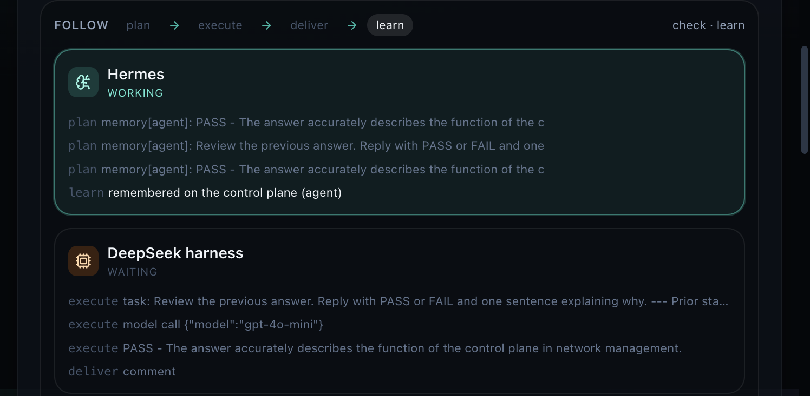
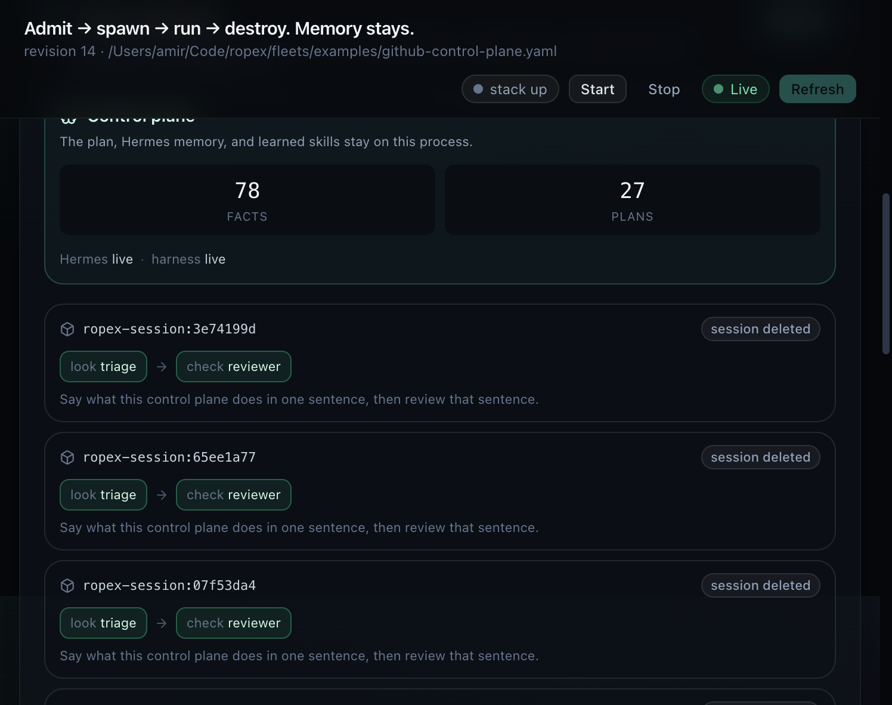
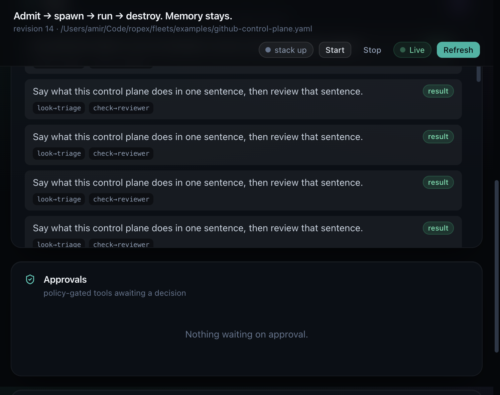

# Ephemeral sessions — one image per plan

A plan is one piece of work with one or more steps. Those steps share files, so they share **one container**. Hermes stays on the control plane. DeepSeek runs inside the session. When the last step learns, Ropex copies memory out and deletes the session image.

The base image `ropex-worker:latest` is built once and kept. Each plan adds a thin layer `ropex-session:<id>`, runs, and removes only that layer.

```text
git desired state
        │
        ▼
control plane  ── Hermes: compose, plan, remember, learn
        │         memory and skills stay here
        │  spawn
        ▼
ropex-session:<plan>     one container, every step
        │  DeepSeek: execute, tools, deliver
        │  copy result.json out
        ▼
delete container + session image
```

In-process mode (the default) runs the same spine inside the control-plane process. Set `ROPEX_EXECUTOR=container` when you want the session to be a real container.

## What stays and what is destroyed

| Lives on the control plane | Lives only inside the session |
| --- | --- |
| Agent definitions and policy caps | The plan's working files |
| Hermes memory and learned skills | Step outputs before they are copied back |
| Pipeline record, trajectories, audit | The container and `ropex-session:<id>` image |

`idleTTLMs: 0` on an on-demand agent means the worker slot is destroyed when the claim finishes. The session runner does the same for the container: `docker rm` / `podman rm`, then `rmi` of the session image. A failed run still deletes the session. The base image is not removed.

## One image, many steps

Stages in one plan run **in order** inside that single container. `look` (triage) can leave a sentence that `check` (reviewer) reads. They do not each get an image, because the next step needs the previous step's files.

Scale is **how many plans run at once**, not how many containers one plan splits into. The example fleet declares:

| Agent | Cap | Meaning |
| --- | --- | --- |
| Policy | `maxReplicas: 64` | Cluster ceiling on live workers |
| triage | `maxConcurrent: 4` | At most four triage claims at once |
| reviewer | `maxConcurrent: 6` | At most six reviewer claims at once |
| pr-factory | `maxConcurrent: 8` | At most eight factory claims at once |

A local Podman machine is one VM. Those numbers are the control-plane commit. A later Kubernetes Job runner would turn the same caps into many nodes. One Mac does not become 64 machines by itself.

## Turn it on

`.env` is read once, at process start, from the working directory. A server that is already listening does not see edits until you restart it. `.env` is gitignored. Do not commit keys.

```bash
# .env  (restart the control plane after changing this)
ROPEX_EXECUTOR=container
# optional overrides
# ROPEX_WORKER_IMAGE=ropex-worker:latest
# ROPEX_CONTAINER_BIN=podman
```

`ROPEX_EXECUTOR=container` does not build an image by itself. Build the base once:

```bash
# Docker, or Podman after `podman machine start`
podman build -t ropex-worker:latest -f Containerfile.worker .
# or
docker build -t ropex-worker:latest -f Containerfile.worker .
```

Then start the dashboard:

```bash
npx tsx src/cli.ts up fleets/examples/github-control-plane.yaml --serve --port 7780
```

Leave `ROPEX_EXECUTOR` unset to stay in-process. That path needs no container runtime. Tests use it.

### Which binary runs the session

`resolveContainerBin` picks, in order:

1. `ROPEX_CONTAINER_BIN` when set
2. `docker` when it is on `PATH`
3. `podman` when it is on `PATH`
4. otherwise the name `docker` (the spawn then fails with a message that names Podman and Docker)

Podman on macOS needs a running machine (`podman machine start`). The API socket port changes between starts. Do not point the control plane at a stale `DOCKER_HOST` from a previous machine.

### Compose

`docker-compose.yml` and `podman-compose.yml` describe two services:

| Service | What it does |
| --- | --- |
| `worker` | Builds `ropex-worker:latest` and exits. It is the base image, not a session. |
| `control-plane` | Serves the dashboard on port 7780 with `ROPEX_EXECUTOR=container`. |

The control plane mounts the container socket so it can `build` / `run` / `rm` session images. Keys come from an optional `.env` file (`env_file`, `required: false`). They are passed into the session with `-e`. They are not copied into the image. `.dockerignore` excludes `.env`.

`npm run up` prefers Podman Compose, then Docker Compose, then a local `tsx` process when neither exists.

Inside the session, `ROPEX_IN_SESSION=1` and `ROPEX_EXECUTOR=inprocess` are forced so the container does not try to start another container.

## What a session actually does

`runPipelineSession` in `src/session.ts`:

1. Write a one-layer Dockerfile: `FROM ropex-worker:latest` plus the plan request.
2. `build -t ropex-session:<id>`.
3. `run --name ropex-session-<id>`, forwarding `OPENAI_API_KEY`, `DEEPSEEK_API_KEY`, `OPENAI_BASE_URL`, and `OPENAI_MODEL` when they are set.
4. The entrypoint is `ropex session-exec /session/request.json`. It runs every stage, then writes `/session/result.json`.
5. `cp` that file back to the host and merge memory, skills, and trajectories into `.ropex/state.json`.
6. `rm -f` the container and `rmi` the session image, including on failure.

The host then replays the session's stage log onto the dashboard stream so you can follow Hermes and DeepSeek after the container exits. Those replayed events are not written a second time into the pipeline record.

## Hermes and DeepSeek inside one plan

Every step is the same spine:

| Phase | Who | What you see |
| --- | --- | --- |
| plan | Hermes | Compose line and plan thoughts, including memory it read |
| execute | DeepSeek harness | Thoughts, tool calls, observations |
| deliver | DeepSeek harness | The comment, check, or pull request it handed back |
| learn | Hermes | A learned skill, or "remembered on the control plane" |

Embedded backends do this in-process. `ROPEX_HERMES_BACKEND=live` asks the `hermes` CLI to plan. `ROPEX_DSH_BACKEND=live` asks headless `dsh` to execute. Both are optional. When a live call fails, Hermes planning falls back to the embedded planner. The session container does not receive those two flags unless you add them yourself; with only the API key forwarded, the session uses the embedded harness and calls the model from that key.

Preferred key: `OPENAI_API_KEY`. Fallback: `DEEPSEEK_API_KEY`. Model defaults are `gpt-4o-mini` at `https://api.openai.com/v1` and `deepseek-chat` for the DeepSeek key. Override with `OPENAI_MODEL` and `OPENAI_BASE_URL`.

Live `dsh` on Node 26 can exit before the model call (`cordis-plugin-hmr` expects Node 22–24). The worker image is Node 22, which is the version that package documents. The control-plane process on the host can be a newer Node; the session is not.

## Simple pipeline

The Run tab has **Simple pipeline**. It does not invent agents. The first run mints triage and reviewer and pins that pair. The next simple run reuses them:

| Step | Agent | Prompt |
| --- | --- | --- |
| `look` | triage | One plain sentence about what this control plane does |
| `check` | reviewer | PASS or FAIL, plus one sentence, using the triage output |

CLI equivalent:

```bash
npx tsx src/cli.ts pipeline --simple
```

`POST /api/v1/pipeline` still requires a prompt field when called by hand. The button sends the simple prompt and `simple: true` together.

## Dashboard



Three places show the same idea.



**Now → Where a plan runs.** Control plane on the left (facts, plan count, Hermes and harness backend). Recent plans in the middle, named `ropex-session:<id>` when container mode is on, with a `reuse` or `mint` badge and `look → triage` then `check → reviewer`. Scale on the right: live workers against `maxReplicas`, and a pip per agent cap. A plan is "session open" only while a step is running, "session deleted" after it finishes, and "not started" while it is still queued.



**Plans.** One row is one plan. The badge says whether the fleet was reused or minted. Chips are `step → agent`.

**Run → Follow.** A live strip. The token moves `plan → execute → deliver → learn`. Hermes lights up for plan and learn. DeepSeek harness lights up for execute and deliver. The first beat of a plan says `reuse fleet <name>` or `mint fleet <name>`. Beats are revealed about twice a second so a container, which emits its log in one burst at the end, is still readable. In-process runs stream as they happen.

## Files

| Path | Role |
| --- | --- |
| `src/session.ts` | Build, run, copy memory out, delete the session |
| `src/session-run.ts` | In-container execution of the request snapshot |
| `src/fleet-bind.ts` | Reuse a pin or mint a working set at submit |
| `src/executor.ts` | Host drain, then replay of stage events onto SSE |
| `src/runtime.ts` | plan / thought / tool / observation / deliver / learn progress |
| `Containerfile` | Control-plane image. Sets `ROPEX_EXECUTOR=container` |
| `Containerfile.worker` | Base image. Forces in-process execution |
| `docker-compose.yml`, `podman-compose.yml` | Build the base, then run the control plane |
| `web/src/components/RunBoard.tsx` | Overview placement board |
| `web/src/components/FollowLanes.tsx` | Run tab follow strip |
| `web/src/hooks/useStream.ts` | SSE client that classifies each beat |

## Sessions and sandboxes

A session runs a whole **pipeline** in one container, Hermes included. A [sandbox](./sandboxes.md) (`spec.sandbox`) runs one agent's **execute stage** per task in a container you configure, with Hermes staying on the control plane. Choose one per deployment: inside a session (`ROPEX_IN_SESSION=1`) a `docker` sandbox fails closed because there is no nested Docker.

## Related

- [Operations](./operations.md) — `npm run up`, Podman, stack API
- [Control-plane UI](./control-plane-ui.md) — screenshots of the board, the plans list, and the follow strip
- [Hermes](./hermes.md) — plan, remember, learn
- [DeepSeek harness](./dsh.md) — execute and deliver
- [Architecture](./architecture.md) — caps, queue, and the start → transform → result spine
