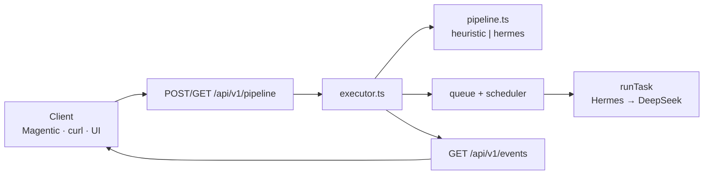

# Ropex executor API

Engine-neutral **HTTP + SSE** contract for external orchestrators (e.g. [Magentic](https://github.com/amirsdream/Magentic)). Ropex remains the execution control plane; clients stay in separate repos.

The same endpoints power the **Pipelines** section in [`ropex ui`](./control-plane-ui.md) (submit form, live SSE drawer).

## Architecture



## Endpoints

| Method | Path | Purpose |
|--------|------|---------|
| `POST` | `/api/v1/pipeline` | Submit a prompt (optional explicit stages) |
| `POST` | `/api/v1/pipeline` `{ "action":"drain", "pipelineId" }` | Scoped sequential drain |
| `GET` | `/api/v1/pipeline?id=<uuid>` | Pipeline status, stages, persisted events |
| `GET` | `/api/v1/pipeline` | List recent pipelines |
| `GET` | `/api/v1/events?pipelineId=<uuid>` | SSE stream (native `kind`) |
| `GET` | `/api/v1/events?pipelineId=<uuid>&format=ui` | SSE with `{ type, data }` (Magentic-compatible) |

Start the server: `npm run up` or `ropex up --serve` (default port **7780**).

## Submit pipeline

```http
POST /api/v1/pipeline
Content-Type: application/json

{
  "prompt": "Compare React vs Vue for a dashboard",
  "drain": true,
  "agents": ["researcher", "synthesizer"],
  "stages": [
    {
      "id": "research",
      "agent": "researcher",
      "role": "researcher",
      "prompt": "Gather sources on React and Vue for dashboards…"
    }
  ]
}
```

| Field | Description |
| --- | --- |
| `prompt` | Required on submit. Used by heuristic/Hermes planner when `stages` omitted |
| `stages` | Optional explicit stage list. Each `agent` must exist in fleet YAML |
| `drain` | Default `true` — run stages sequentially before HTTP response completes |
| `drain: false` | Plan only; drain later via `{ action: "drain", pipelineId }` |
| `concurrency` | Passed to scoped drain (default 1 — stages stay sequential) |

Response:

```json
{
  "ok": true,
  "pipeline": {
    "id": "uuid",
    "status": "done",
    "input": { "prompt": "…", "agents": ["researcher"], "at": "…" },
    "stages": […],
    "events": […],
    "output": "…",
    "result": {
      "status": "done",
      "output": "…",
      "stageCount": 2,
      "producedBy": ["researcher", "synthesizer"],
      "at": "…"
    }
  },
  "drained": 2
}
```

## Phase spine: start → transform → result

Every run has one explicit spine. It is never ambiguous where a run starts, where it does work, or where it ends:

| Phase | Point | Field | Meaning |
| --- | --- | --- | --- |
| `intake` | **Start** | `input` | Normalized prompt (+ pinned `agents`) captured when the run is accepted. Set once, never mutated. |
| `execute` | **Transform** | `stages` | The one place work happens — stages run sequentially with context handoff. |
| `result` | **Result** | `result` | The single terminal outcome, written exactly once when the run reaches `done`/`failed`. |

`pipelinePhase(run)` returns the current phase (`intake` before any stage runs, `execute` once a stage is running/done, `result` on terminal). The legacy `output` string is retained for backward compatibility and mirrors `result.output`.

The per-task workflow (`compose · plan · execute · deliver · learn`) rolls up onto the same three phases via `workflowPhases()`: `compose`+`plan` → **Start**, `execute` → **Transform**, `deliver`+`learn` → **Result**.

## Async drain (Magentic pattern)

```http
POST /api/v1/pipeline
{ "prompt": "Build auth middleware", "drain": false }

GET /api/v1/events?pipelineId=<uuid>&format=ui
# SSE connects; replays persisted + live events

POST /api/v1/pipeline
{ "action": "drain", "pipelineId": "<uuid>" }
```

Drain claims **only** queue items whose task id starts with `<pipelineId>:` — other queue work is untouched.

## Sequential stages + context handoff

Stages run **one at a time**. Each stage keeps an immutable `basePrompt`; prior outputs are recomputed into `prompt` on every drain:

```text
--- Prior stage outputs ---
[research/researcher]
…output from stage 1…
```

Completed outputs are written into shared memory (when the agent allows) with tags `pipeline`, `<pipelineId>`, `<stageId>`, `<role>`.

**Terminal gating:** `pipeline.complete` / `pipeline.error` / `pipeline.end` fire only when the run is fully done or failed — not after a partial drain with pending stages.

Stage outputs prefer trajectory **observations** (not tool-name stubs) so handoff carries real content.

## Event stream

### Native executor events (`kind`)

| `kind` | Meaning |
|--------|---------|
| `pipeline.start` | Run accepted |
| `pipeline.plan` | Stage plan ready (`meta.agents` JSON for UIs) |
| `stage.start` | Stage running |
| `stage.log` | Mid-stage progress (from `onProgress`) |
| `stage.complete` | Stage finished |
| `stage.failed` | Stage dead-lettered |
| `pipeline.complete` | All stages done |
| `pipeline.error` | Run failed |
| `pipeline.end` | SSE terminal — closes subscribers |

Events persist on `pipeline.events` (capped) in `.ropex/state.json`.

### UI / Magentic mapping (`format=ui`)

| Native `kind` | UI `type` |
| --- | --- |
| `pipeline.plan` | `plan` |
| `stage.start` | `agent_start` |
| `stage.log` | `agent_log` |
| `stage.complete` / `stage.failed` | `agent_complete` (`error: true` on failure) |
| `pipeline.complete` | `complete` |
| `pipeline.error` | `error` |
| `pipeline.end` | `stream_end` |

Implementation: `mapExecutorEventToUi()` in `src/executor.ts`.

## Planners

| Env | Behavior |
|-----|----------|
| `ROPEX_PIPELINE_PLANNER=heuristic` (default) | Regex multi-stage planner in `src/pipeline.ts` |
| `ROPEX_PIPELINE_PLANNER=hermes` | Seed stages from Hermes offline `plan()` on first fleet agent |

Per-task execution still runs full Hermes → harness inside `runTask()`. Progress hooks emit `stage.log` before `stage.complete` during drain.

## Magentic integration

```env
EXECUTION_ENGINE=ropex
ROPEX_BASE_URL=http://127.0.0.1:7780
```

Adapter branch in Magentic repo: `cursor/ropex-engine-4b15`

- `src/engines/ropex_executor.py` — submit, SSE relay, scoped drain
- `src/config.py` — engine selection
- `src/api.py` — bypass LangGraph when `EXECUTION_ENGINE=ropex`

Flow:

1. `POST /api/v1/pipeline` `{ prompt, drain: false }`
2. `GET /api/v1/events?pipelineId=&format=ui`
3. `POST /api/v1/pipeline` `{ action: "drain", pipelineId }`
4. Relay `{ type, data }` → Magentic WebSocket

**Role mapping:** stage `agent` fields must match fleet `metadata.name`, not Magentic display roles. Align names or POST explicit `stages`.

Full integration guide: [integrations/magentic/README.md](../integrations/magentic/README.md).

## CLI

```bash
ropex apply fleets/
ropex pipeline "Implement auth middleware tests"
ropex pipeline "Plan only" --no-drain
ropex ui   # Pipelines form + live SSE drawer
```

## Control-plane UI

The built-in dashboard uses the same API:

- **Run** → `POST /api/v1/pipeline` `{ prompt, drain: true }` → opens detail drawer
- **Live logs** → `EventSource(/api/v1/events?pipelineId=…&format=ui)`
- **View** → `GET /api/v1/pipeline?id=…`

See [control-plane-ui.md](./control-plane-ui.md).

## Testing

Network-free tests in `tests/executor-api.test.ts`:

- Sequential planning + drain
- Scoped async drain (`taskIdPrefix`)
- Stage context handoff
- Terminal event gating
- HTTP POST/GET pipeline routes
- `stage.log` emission

Run: `npm test`

## Related

- [HTTP API reference](./api.md)
- [Architecture — executor layer](./architecture.md#executor-api-multi-stage-pipelines)
- [Hermes wiring](./hermes.md)
- [DeepSeek wiring](./dsh.md)
