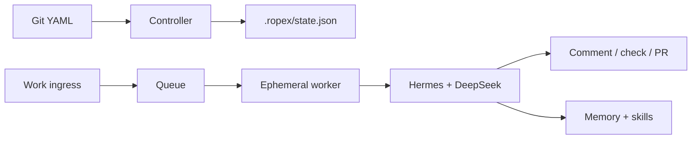
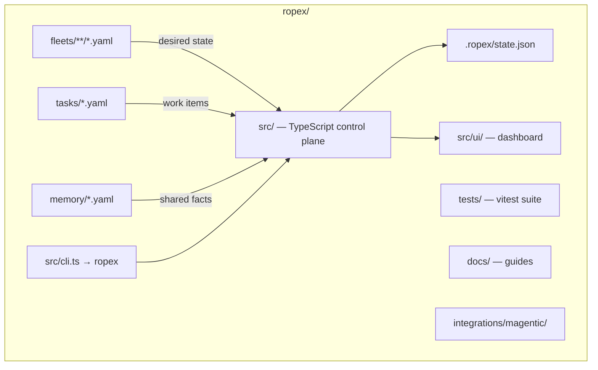
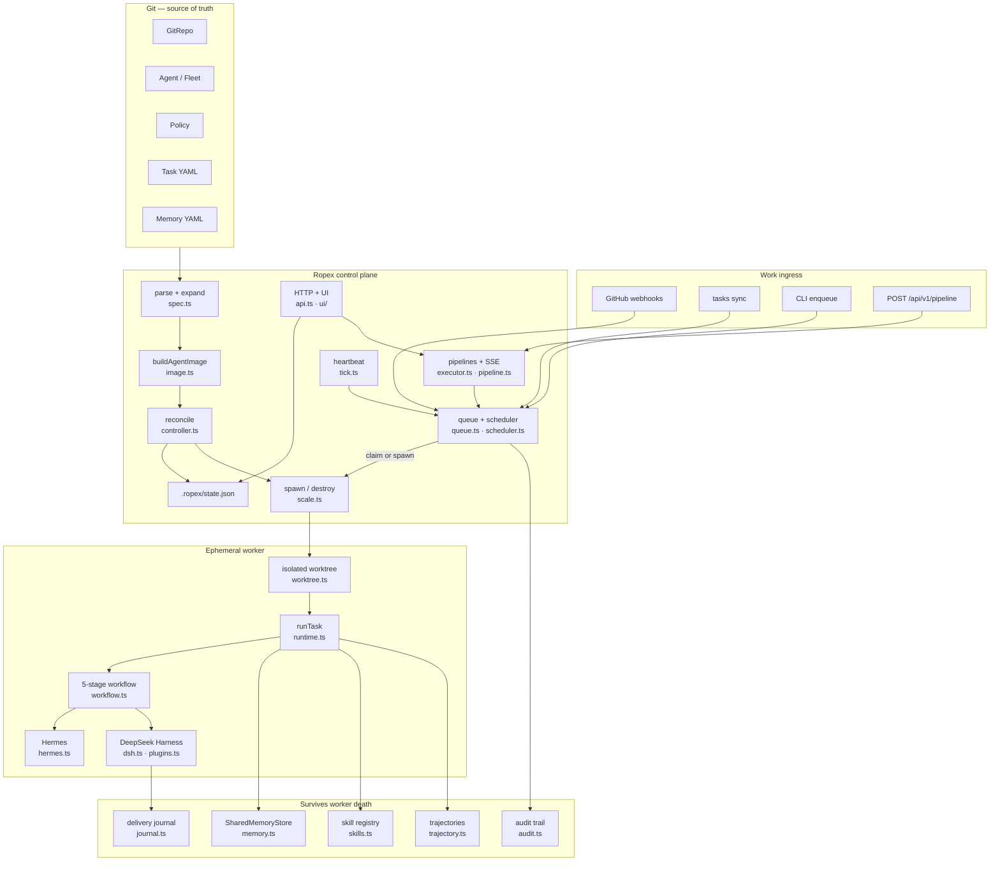
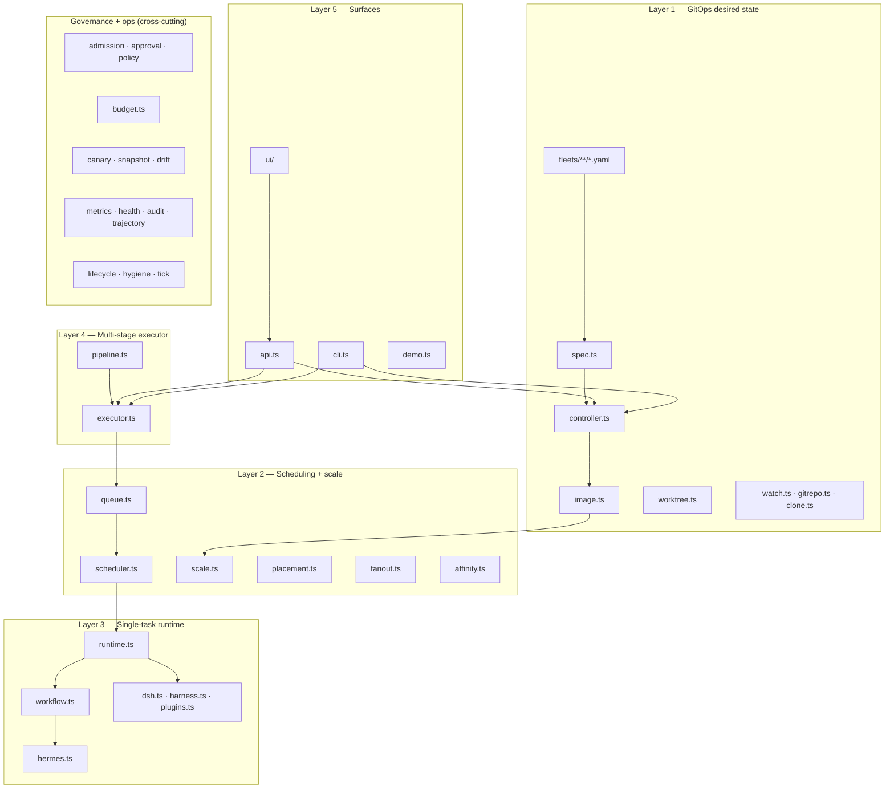
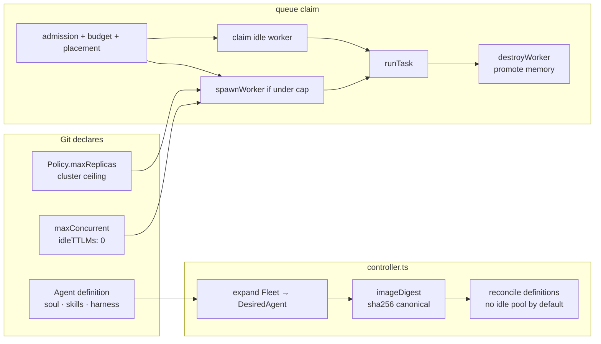
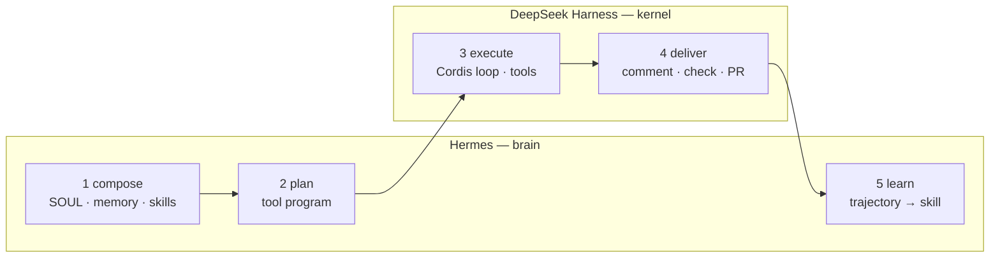
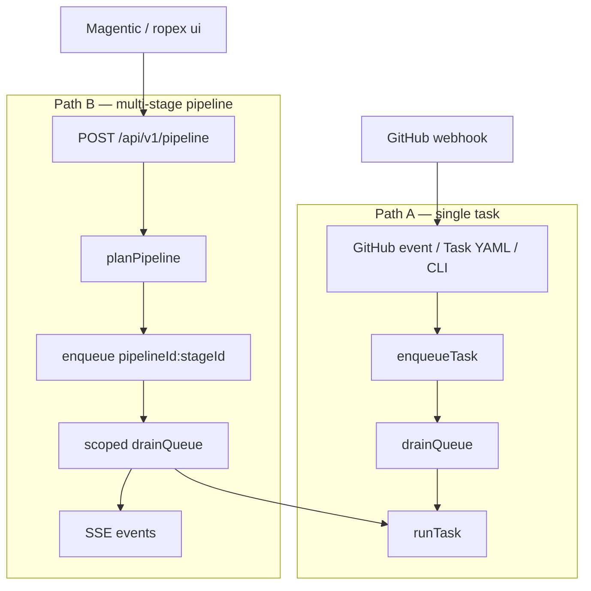
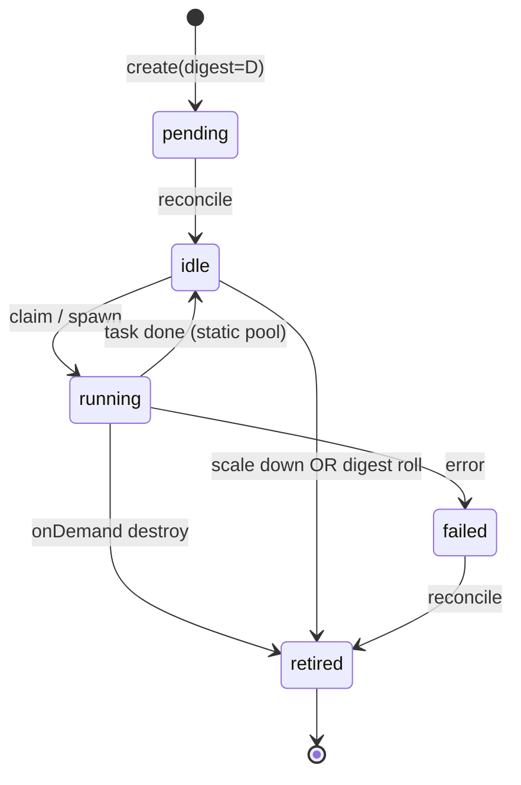
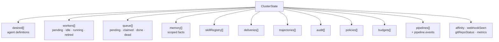
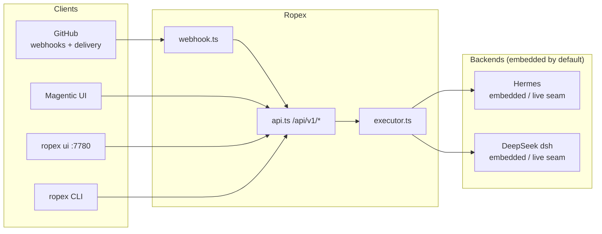

# Ropex system architecture (visual)

Visual reference for how Ropex is structured today. Diagrams render in GitHub, VS Code, and `ropex ui` markdown viewers.

For narrative detail see [architecture.md](./architecture.md). For API contracts see [api.md](./api.md) and [executor-api.md](./executor-api.md).

---

## At a glance

Ropex is a **GitOps control plane for agent fleets**:

- **Git** holds agent definitions, policy caps, tasks, and memory — not warm replica inventory.
- The **controller** reconciles immutable agent images (content-addressed digests).
- The **queue** admits work, spawns ephemeral workers on demand, and destroys them when idle.
- Each task runs a fixed **Hermes → DeepSeek** workflow: plan/remember/learn vs execute/deliver.
- **Memory and skills** survive worker death on a scoped shared bus.



---

## Repository layout



| Path | Role |
| --- | --- |
| `fleets/**/*.yaml` | `Agent`, `Fleet`, `Policy`, `GitRepo` manifests |
| `tasks/*.yaml` | Forge-neutral work inbox |
| `memory/*.yaml` | Git-declared shared memory facts |
| `src/` | Control plane implementation (~58 modules) |
| `src/ui/` | Static control-plane dashboard (`ropex ui`) |
| `.ropex/state.json` | Local cluster state (etcd stand-in) |
| `integrations/magentic/` | External UI adapter notes |

---

## End-to-end system



---

## Five layers



| Layer | Key modules | Responsibility |
| --- | --- | --- |
| 1 — GitOps | `spec`, `controller`, `image`, `worktree` | Parse YAML, expand fleets, stamp digests, reconcile |
| 2 — Schedule | `queue`, `scheduler`, `scale`, `placement` | Enqueue, claim/spawn, fair drain, leases, DLQ |
| 3 — Runtime | `runtime`, `workflow`, `hermes`, `dsh` | One task: compose → plan → execute → deliver → learn |
| 4 — Executor | `pipeline`, `executor` | Multi-agent sequential pipelines + SSE |
| 5 — Surfaces | `cli`, `api`, `ui` | Operate and observe without touching internals |

---

## Capacity model

Default scale is **on-demand**: workers spawn when work arrives and destroy when idle (`idleTTLMs: 0`). Opt into standing pools with `scale: static`.



| Mode | Git field | Reconcile | Claim |
| --- | --- | --- | --- |
| `onDemand` (default) | `maxConcurrent`, `idleTTLMs` | Definitions only | Spawn if under cap |
| `static` (opt-in) | `replicas` | Standing warm pool | Pick idle worker |

`Policy.maxReplicas` is the cluster ceiling on **live** workers — never uncapped spawn.

---

## Per-task workflow

Ropex does not invent a third agent loop. It schedules a fixed pipeline:



| Stage | Owner | Module |
| --- | --- | --- |
| compose | Hermes | `hermes.ts` |
| plan | Hermes | `hermes.ts` |
| execute | DeepSeek | `dsh.ts`, `plugins.ts` |
| deliver | DeepSeek | `dsh.ts`, `journal.ts` |
| learn | Hermes | `hermes.ts`, `skills.ts` |

---

## Two work ingress paths



**Path A** — one task, one worker, standard queue drain.

**Path B** — external orchestrator submits a prompt; Ropex plans sequential stages, drains only tasks matching `<pipelineId>:*`, and streams SSE events until `pipeline.end`.

---

## Worker lifecycle



Each live worker gets an isolated **worktree** under `sandbox/worktrees/`. Digest drift fails closed — `runTask` requires worker digest == desired image digest.

---

## Cluster state

Everything operational lives in `.ropex/state.json`:



---

## Kubernetes mapping

Ropex is GitOps-inspired, not a Kubernetes clone:

| Kubernetes | Ropex |
| --- | --- |
| Deployment / ReplicaSet | `Fleet` / `Agent` |
| Pod | Worker (one replica slot) |
| Container image digest | Agent image digest |
| etcd | `.ropex/state.json` |
| Admission / ResourceQuota | `Policy` (maxReplicas + denylist + budget) |
| kubelet | `runtime.ts` (`runTask`) |
| Ingress | GitHub events, Task YAML, executor API |

---

## External integrations



Live backends are optional seams — see [hermes.md](./hermes.md) and [dsh.md](./dsh.md).

---

## Module quick reference

| Area | Files |
| --- | --- |
| Spec / reconcile | `spec.ts`, `controller.ts`, `image.ts`, `worktree.ts`, `watch.ts`, `gitrepo.ts`, `clone.ts`, `tick.ts`, `canary.ts`, `snapshot.ts`, `drift.ts` |
| Brain / execute | `hermes.ts`, `dsh.ts`, `harness.ts`, `plugins.ts`, `workflow.ts`, `runtime.ts` |
| Executor API | `pipeline.ts`, `executor.ts` |
| Memory / skills | `memory.ts`, `skills.ts`, `gitmemory.ts`, `contracts.ts` |
| Queue / scale | `queue.ts`, `scheduler.ts`, `scale.ts`, `fanout.ts`, `admission.ts`, `approval.ts`, `autoscale.ts`, `budget.ts`, `placement.ts`, `fairness.ts` |
| Ingress / audit | `webhook.ts`, `ratelimit.ts`, `journal.ts`, `deliver.ts`, `trajectory.ts`, `metrics.ts`, `health.ts`, `audit.ts` |
| Lifecycle | `lifecycle.ts`, `hygiene.ts`, `chaos.ts` |
| Surfaces | `api.ts`, `ui/`, `cli.ts`, `demo.ts` |

---

## View locally

```bash
# Open in browser after starting the control plane
npx tsx src/cli.ts apply fleets/examples/github-control-plane.yaml
npx tsx src/cli.ts ui    # http://127.0.0.1:7780
```

On GitHub, open this file directly — Mermaid diagrams render in the file preview.
