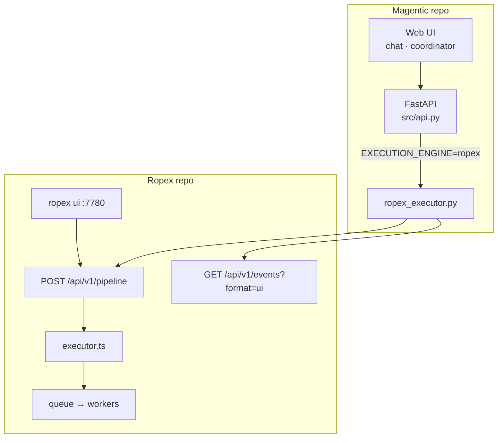
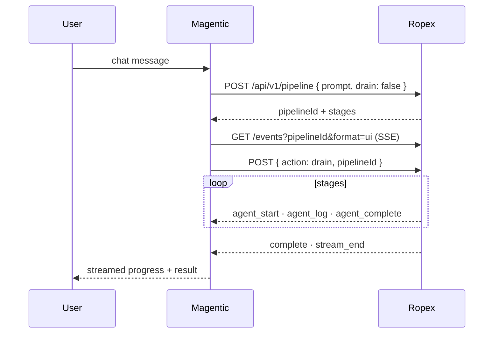

# Magentic + Ropex integration

**Magentic** provides conversational orchestration UI. **Ropex** provides GitOps execution (Hermes plan → DeepSeek execute → queue → workers). Repos stay independent — the contract is HTTP + SSE only.

## Architecture



| Concern | Owner |
| --- | --- |
| User chat, session, WebSocket | Magentic |
| Fleet YAML, workers, queue, Hermes/DSH runtime | Ropex |
| Multi-stage plan + sequential drain | Ropex executor API |
| Event shape for UI | Ropex maps to `{ type, data }` via `format=ui` |

## Ropex side

```bash
git clone https://github.com/amirsdream/ropex
cd ropex
npm install
ropex apply fleets/examples/github-control-plane.yaml
ropex ui   # http://127.0.0.1:7780
```

Verify executor:

```bash
curl -s -X POST http://127.0.0.1:7780/api/v1/pipeline \
  -H 'content-type: application/json' \
  -d '{"prompt":"Hello from Magentic","drain":true}' | jq .
```

The pipeline JSON follows one **start → transform → result** spine: `input` (the accepted prompt/agents), `stages` (sequential execution), and `result` (the single terminal outcome: `status`, `output`, `stageCount`, `producedBy`). Relay `result` as the final Magentic message; use `stages` for per-agent progress.

Docs: [executor-api.md](../../docs/executor-api.md), [control-plane-ui.md](../../docs/control-plane-ui.md).

## Magentic side

In Magentic `.env`:

```env
EXECUTION_ENGINE=ropex
ROPEX_BASE_URL=http://127.0.0.1:7780
```

Apply adapter branch `cursor/ropex-engine-4b15`:

| File | Role |
| --- | --- |
| `src/engines/ropex_executor.py` | Submit pipeline, SSE relay, scoped drain |
| `src/config.py` | `EXECUTION_ENGINE`, `ROPEX_BASE_URL` |
| `src/api.py` | Route queries through Ropex when engine=ropex (skip LangGraph) |

When `EXECUTION_ENGINE=ropex`, Magentic does **not** run its internal LangGraph executor.

## Request flow



## Role → fleet mapping

Ropex pipeline stages reference **fleet agent names** (`metadata.name` in Agent YAML):

```yaml
metadata:
  name: researcher   # ← use this in stages[].agent
```

Magentic display roles (e.g. "Research Analyst") must map to these names, or Magentic POSTs explicit `stages` from its coordinator plan.

## Optional Ropex env

| Variable | Effect |
| --- | --- |
| `ROPEX_PIPELINE_PLANNER=heuristic` | Default regex planner |
| `ROPEX_PIPELINE_PLANNER=hermes` | Embedded Hermes brain seeds stages |
| `ROPEX_HERMES_BACKEND=live` | Live hermes-agent per task (worktree cwd) |
| `ROPEX_DSH_BACKEND=live` | Live `@deepseek-ai/dsh` (needs `OPENAI_API_KEY` preferred, or `DEEPSEEK_API_KEY`) |

Default backends are **embedded** (in-process Hermes + Cordis harness) — fine for integration testing without API keys.

## Alternative: Ropex UI only

You can operate without Magentic using the built-in control plane:

- **Pipelines** — submit prompts, live SSE stage logs
- **Trajectories** — inspect Hermes→DeepSeek runs
- **Hermes & DeepSeek** — per-agent config drill-down

This is ops/observability, not chat. See [control-plane-ui.md](../../docs/control-plane-ui.md).

## Troubleshooting

| Symptom | Check |
| --- | --- |
| `unknown agent` on submit | Stage `agent` not in applied fleet YAML |
| Empty SSE | `pipelineId` mismatch; ensure drain started |
| Stages stuck `running` | `ropex drain` or POST scoped drain |
| 404 on `/api/v1/pipeline` | Old UI process — restart `ropex ui` after upgrade |

## Related

- [Executor API](../../docs/executor-api.md)
- [Architecture](../../docs/architecture.md)
- [HTTP API](../../docs/api.md)
